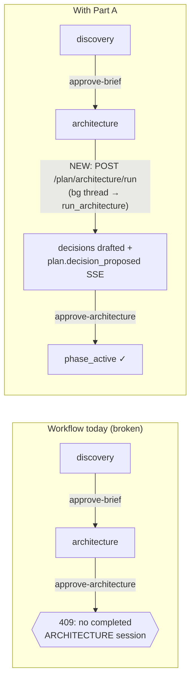

# Backlog: API stability + frontend recovery

## Context

The analysis surfaced a cluster of failures across the planner workflow. Investigation pins them to **three root causes**, not many independent bugs:

1. **No API endpoint runs the architecture / phase-review sessions.** `orchestrator.run_architecture()` and `run_phase_review()` exist and are wired into the **CLI** (`src/infra/cli/plan/commands.py`), but **no FastAPI route calls them**. So over HTTP the flow is: `approve-brief` moves the plan `discovery → architecture`, and then nothing ever drafts the architecture. `approve-architecture` then fails with `409 "No completed ARCHITECTURE session found"` (`src/app/planning/sessions/usecases.py:185-187`). This is the recurring dead-end the user hit on every project. The same gap blocks phase review.

2. **`.gitignore` silently excludes the entire frontend data layer.** Line 16 of the root `.gitignore` is a blanket `lib/` (a Python build-artifact pattern). `git check-ignore` confirms it matches `frontend/src/lib/`. Every component imports from `../lib/queries`, `../lib/time`, `../lib/layout` (queryClient, `usePlan`, `useGoals`, `useAgents`, `useSendChatMessage`, `useStartDiscovery`, `useApproveBrief/Architecture/Phase`, `useSSEBridge`, `relTime/absTime/useNow`, `buildFlowFromGoals/GOAL_COLORS`), but **none of those files are in the repo** — they were never committed, and aren't present in this container. The committed frontend cannot build. The user's app only runs because the files exist locally, untracked.

3. **Provider API errors aren't translated into a meaningful planner failure.** When the configured model can't do tool use, OpenRouter returns `404 "No endpoints found that support tool use"`. The adapter (`openai_adapter.py:53`) lets the raw `openai.NotFoundError` propagate; the session fails with an opaque provider string instead of an actionable message. `anthropic_adapter.py:40` has the same gap.

Plus a smaller gap: `/api/agents` only supports GET + POST — no edit/delete for full CRUD (the registry port already has `register` upsert + `deregister`).

> **Scope note (project-management UI):** The "create/switch/delete/edit projects + provider/model config + agent-registry editor" UI is **deferred**. The backend exposes only `GET /project/context` and `POST /project/reset` — no project list/create/switch/delete or settings-edit endpoints exist. That UI needs a new backend subsystem and is its own effort; this plan calls it out but does not build it.

---

## Part A — Backend (fully implemented + verified here)

### A1. Architecture & phase-review run endpoints  *(fixes the 409 dead-end)*
Add two session-pattern endpoints. Model them on `discovery.py` / `refinement.py`: spawn a daemon thread, return `202 SessionAccepted`, publish SSE on completion. The global planner hook (`server.py:_wire_planner_sse_hook`) already forwards `plan.decision_proposed` / `plan.phase_proposed` to SSE, so the GatePanel checklist gets data automatically once the session runs.

- **File:** add to `src/api/routers/plan.py` (keeps all `/plan` lifecycle routes together). Import `threading`, `registry` (`src/api/sessions.py`), `publish_sse`, `SessionAccepted`.
- `POST /plan/architecture/run` → `202`:
  - `409` if `registry.active("architecture")` is not None (reuse the discovery guard pattern).
  - `session = registry.create("architecture")`; daemon thread calls `orchestrator.run_architecture()` (autonomous — ignores io_handler).
  - On result: `result.failure_reason` → `session.fail(...)`; else `session.complete({"decisions": [...], "phases": [...]})` (serialize `pending_decisions`/`pending_phases` ids+domains). `finally`: publish `plan.architecture_completed` / `plan.architecture_failed`.
- `POST /plan/phase-review/run` → same shape, `kind="phase_review"`, calls `orchestrator.run_phase_review()`; publishes `plan.phase_review_completed` / `_failed`.
- Use `PlanOrchestratorDep`. No try/except in the handler — only inside the thread `run()` (matches `discovery.py`).

### A2. Provider tool-use error guard
Wrap the provider call in each adapter's `send_turn` and re-raise as `PlannerRuntimeError` (already imported in the runtime layer; `from src.domain.ports.planner import PlannerRuntimeError`). The base runtime + use cases already treat `PlannerRuntimeError` as a clean session failure (`base_agent_runtime.py`, `usecases.py:66`), so the failure reason becomes the meaningful message surfaced to the UI.

- **`openai_adapter.py` `send_turn` (line ~53):** `try/except openai.APIError as exc`. Classify: if `getattr(exc, "status_code", None) == 404` or `"tool use"`/`"tool_use"` in `str(exc).lower()` → message: `f"The configured model '{self._model}' does not support tool use, which the planner requires. Select a tool-capable model/provider."` Otherwise generic: `f"Planner LLM request failed ({type(exc).__name__}): {exc}"`. Re-raise `PlannerRuntimeError(message) from exc`.
- **`anthropic_adapter.py` `send_turn` (line ~40):** same guard, catching `anthropic.APIError`.
- Add a small shared classifier helper in `adapters/__init__.py` (or inline per adapter — keep provider imports inside the provider adapter).

### A3. Agents CRUD (edit + delete)
Add to `src/api/routers/agents.py` (registry port already supports it; add a `get_agent_registry` is available via `AgentRegistryDep`).

- `PUT /agents/{agent_id}` → update an existing agent. `404` if `registry.get(agent_id)` is None; else build `AgentProps` from `AgentRegisterRequest` (reuse the POST body shape; path `agent_id` wins) and `registry.register(props)`. Return `AgentResponse`.
- `DELETE /agents/{agent_id}` → `404` if unknown, else `registry.deregister(agent_id)`, return `204`.
- Reuse `AgentRegisterRequest` / `AgentResponse` from `schemas/agents.py`.

**Backend tests:** extend `tests/unit/api` (or add) route tests with the `mock_container` fixture — architecture-run 202 + 409-when-active; agents PUT/DELETE happy + 404; adapter test asserting a simulated `NotFoundError` becomes `PlannerRuntimeError` with the tool-use message. Run `pytest tests/unit`, `mypy src`, `ruff check src --fix`.

---

## Part B — Frontend foundation (root-cause fix + make the repo build)

### B1. Fix `.gitignore` (the actual root cause)
Change the blanket `lib/` (and `lib64/`) to repo-anchored Python paths so it stops swallowing `frontend/src/lib/`. Replace lines 16–17 with anchored/scoped patterns (e.g. `/build/`, `/lib64/`, and `**/site-packages/`), and add an explicit `!frontend/src/lib/` un-ignore as a belt-and-suspenders guard. Verify with `git check-ignore -v frontend/src/lib/queries.ts` returning nothing.

### B2. Reconstruct the missing data layer so the frontend builds & runs
The files are absent from this container (gitignored away), so they must be recreated from the call sites. Build them against the live backend + the new Part-A endpoints. Match the exact shapes the components already consume:

- **`frontend/src/lib/time.ts`** — `relTime(at: number|null, now: number)`, `absTime(at: number)`, `useNow(intervalMs)` (re-renders on a timer). Derived from usage in `TopBar`, `LifecycleRail`, `Activity`, `GatePanel`, `Overview`.
- **`frontend/src/lib/queries.ts`** — exported `queryClient`; hooks returning React-Query shapes the components assume:
  - `usePlan()` → `{ data: PlanResponse, isLoading }` ← `GET /api/plan`
  - `useGoals()` → `{ data: Goal[] }` ← `GET /api/goals`; `useAgents()` ← `GET /api/agents`
  - `useStartDiscovery()` → mutation (`.mutate()`, `.isPending`) ← `POST /api/plan/discovery/start`
  - `useSendChatMessage()` → returns an **async callable** `(text) => Promise` (ChatPanel does `await sendMessage(text)`); routes to `/api/plan/discovery/{id}/message` in discovery, else `/api/plan/refine`, mirroring CLAUDE.md's chat-routing rule; toggles `setThinking`.
  - `useApproveBrief()`, `useApproveArchitecture()`, `useApprovePhase()` → mutations hitting the matching `/api/plan/approve-*` routes; on success `queryClient.invalidateQueries(['plan'])`.
  - `useSSEBridge()` → opens `EventSource('/api/events')`, drives `usePlannerStore`: `pushEvent`, `setConnectionState`, and maps `plan.decision_proposed → addDecision`, `plan.status_changed → invalidate plan/goals`, `plan.discovery_question → addMessage`, clears decisions on phase activation. Reuse the store actions already defined in `plannerStore.ts`.
  - Types come from `src/types/generated/` (openapi-ts) — do not hand-redefine DTOs.
- **`frontend/src/lib/layout.ts`** — `buildFlowFromGoals(goals, …)`, `GOAL_COLORS`, `GoalGroupData` (used by `PlanCanvas`, `GoalGroupNode`). Use `dagre` per CLAUDE.md.

> ⚠️ The user has a working local copy of `frontend/src/lib/` that this reconstruction will parallel. Call this out in the PR body so they reconcile (their copy is untracked; once B1 lands they can diff/commit their version over this one). The reconstruction's purpose is to make the committed repo build and to host the Part-C wiring.

---

## Part C — Frontend UX fixes (the analysis bugs), built on Part B

1. **Run-architecture step in the UI** *(closes the loop with A1).* In `LifecycleRail.tsx`: when `status === 'architecture'` and there is no running session and no proposed decisions, show a **"Draft architecture"** button calling the new `POST /plan/architecture/run`; while running, the existing live-session card already renders progress. GatePanel's architecture gate then enables once `decisions.length > 0`. Same pattern for `phase_review` → "Run phase review".
2. **Toasts for flow errors** *(not buried in chat).* Add a lightweight toast system: `frontend/src/lib/toast.ts` (zustand slice or a tiny context) + a `<Toaster/>` mounted in `App.tsx`. Route mutation `onError` (approve-brief/architecture/phase, discovery, chat) to a toast with the server `detail`. Replace the current "⚙ Approve architecture failed…" chat system-messages.
3. **Discovery: finish early.** Add a "Finish discovery & draft brief" affordance. Backend already completes via the runner; expose a control that sends a terminal answer / stop — minimal version: a button in the discovery session card that posts a final "that's enough, draft the brief" message via `useSendChatMessage`, plus copy clarifying the planner will wrap up. (No new backend route required.)
4. **Edit / delete brief before approving.** In GatePanel's brief gate: an "Edit brief" mode (editable vision/constraints/exit-criteria/open-questions) and a "Discard & restart discovery" action (clears the drafted brief locally and re-runs `useStartDiscovery`). Approve remains the primary action.
5. **Fix the "discovery active vs no session" confusion.** The chat hydration line claims discovery is active before a session exists. Gate the "Discovery is active — answer questions" copy on an actually-running session; otherwise show "Start discovery in the left rail." Keep a single Start-discovery entry point (LifecycleRail) and have ChatPanel reference it rather than offering a second button that desyncs.
6. **Activity copy button.** In `Activity.tsx`, add a per-row (and "copy all") copy-to-clipboard control over the mono log.

---

## Out of scope (follow-up)
Project/provider/model management UI (create/list/switch/delete/edit projects, provider+model config, agent-registry editor). Requires new backend project-CRUD + settings endpoints that don't exist yet.

## Verification
- **Backend:** `pytest tests/unit && mypy src && ruff check src`. Then manually: start API (`python -m src.infra.cli.main system api --port 8000`), drive `discovery → approve-brief → POST /plan/architecture/run` (confirm `plan.decision_proposed` on `/api/events` and a completed ARCHITECTURE session) → `approve-architecture` returns 200 + dispatches goals. `curl` PUT/DELETE `/api/agents/{id}`. Point the planner at a non-tool model and confirm the session fails with the clear tool-use message, not a raw 404.
- **Frontend:** `cd frontend && npm install && npm run build` (must compile with the reconstructed `lib/`), then `npm run dev` against the running API — confirm the lifecycle rail advances through Draft-architecture → approve, approve failures surface as toasts, and the Activity copy button works.
- Open a PR (do not merge) with a body noting the local-`lib/` reconciliation and the deferred project-management UI.