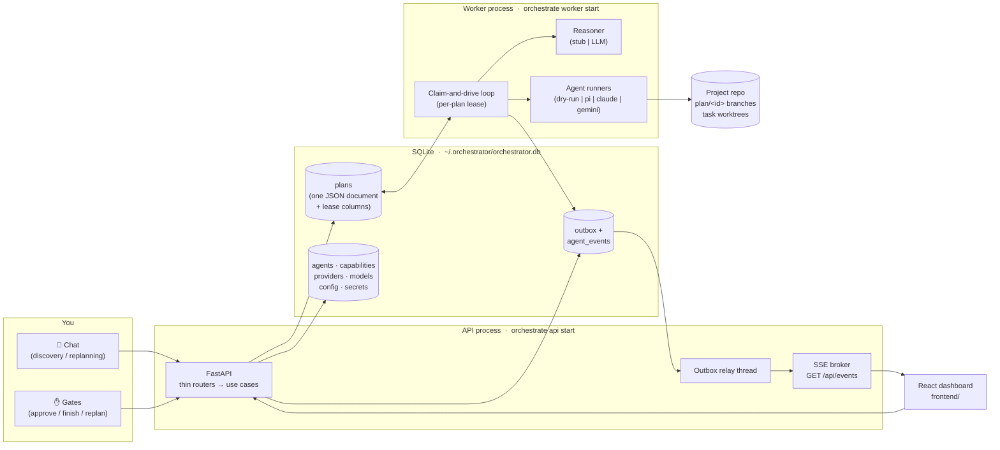
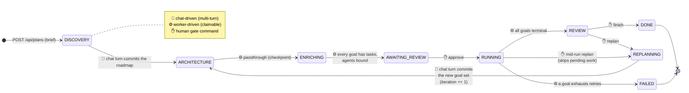

# AIPOM — Agent Orchestrator

**A local-first orchestrator that turns a project brief into an executed plan, with a human approving every consequential step.**

You describe what you want in a chat. A planning LLM (the *reasoner*) negotiates a roadmap of goals with you, breaks each goal into executable tasks just-in-time, and binds each task to a coding agent (Claude Code, Gemini CLI, or `pi`). A worker process executes tasks one at a time, each in an isolated git worktree that merges into a per-plan branch only on success. You gate the plan before execution starts and after it finishes — and you can re-plan conversationally at any point without losing history.

Everything runs on your machine: state is a single SQLite file, credentials are envelope-encrypted, and the default mode (`dry-run` + stub reasoner) exercises the entire system without any API key.



---

## Table of contents

- [How a plan flows](#how-a-plan-flows)
- [Quick start (dry-run, no API key)](#quick-start-dry-run-no-api-key)
- [Going real](#going-real)
- [Repository layout](#repository-layout)
- [CLI reference](#cli-reference)
- [Configuration](#configuration)
- [HTTP API](#http-api)
- [Testing](#testing)
- [Contributing / workflow](#contributing--workflow)
- [Documentation map](#documentation-map)
- [Project status](#project-status)

---

## How a plan flows

The plan lifecycle is a nine-phase state machine. Three different drivers advance it — **your chat messages**, **the worker**, and **your explicit gate commands** — and each phase belongs to exactly one driver. Phases the worker cannot advance are simply invisible to it (the claim predicate excludes them), so nothing ever spins waiting for input.



Key mechanics, each explained in depth in [`docs/architecture/`](docs/architecture/):

- **Multi-turn discovery with commit** — each chat message is one reasoner turn; a reply *without* goals keeps the conversation open, a reply *with* goals is the roadmap commit. Your messages are persisted before the LLM is called, so they survive a reasoner crash.
- **ARCHITECTURE is a deliberate no-LLM passthrough** — the conversation already committed the user-agreed roadmap; the phase remains as a crash checkpoint and as the seam for a future autonomous structuring pass.
- **ENRICHING is just-in-time** — one task-less goal per worker step is broken into 1..N plain tasks; a goal that already has tasks is never re-enriched, so a crash resumes exactly where it stopped.
- **Execution is a pull-scan** — "what runs next" is *derived* by re-scanning statuses every step (`next_action`); there is no stored cursor to desync. Failed tasks retry with durable exponential backoff; `token_limit`/`auth_error` failures are terminal immediately.
- **The replan loop is append-only** — completed goals are never touched; they stay as history *and* as context for the next iteration's conversation.
- **Every task attempt runs in a git worktree** on `task/<task_id>/a<attempt>`, branched off `plan/<plan_id>`. Success `--no-ff`-merges into the plan branch; failure deletes the worktree and branch — a failed attempt leaves zero trace. `main` is never touched.

## Quick start (dry-run, no API key)

Requires Python 3.11+ and Node 18+.

```bash
# 1. Backend install + database
cd backend
uv pip install -e .[dev]                       # or: pip install -e .[dev]
python -m src.infra.cli.main db upgrade        # DB under ORCHESTRATOR_HOME (default ~/.orchestrator)
python -m src.infra.cli.main seed demo --stub  # capabilities, default agent, stub reasoner config

# 2. Two processes (separate terminals)
python -m src.infra.cli.main api start --port 8000
python -m src.infra.cli.main worker start

# 3. Frontend
cd ../frontend
npm install && npm run dev                     # http://localhost:5173
```

> **After every pull, re-run `python -m src.infra.cli.main db upgrade` before seeding or starting the API/worker.** `seed demo` and the processes assume the schema is at head — they do not migrate. A DB left on an older revision fails with a cryptic `sqlite3.OperationalError: no such column: …` (e.g. `agents.runtime_type`, added by migration `0004_agent_runtime`). The fix is always `db upgrade`.

Create a plan in the UI and drive it with the stub reasoner's deterministic chat grammar:

| You type | What happens |
|---|---|
| `ask: anything` | The reasoner replies with a question — the conversation stays open |
| `goal: Build the API`<br>`task: scaffold FastAPI [caps: backend]`<br>`goal: Add tests` | The roadmap commits: listed goals (with optional pre-seeded tasks) → ARCHITECTURE → ENRICHING fills task-less goals → AWAITING_REVIEW |

Then **approve** → watch tasks execute live (the dry-run runner simulates work, including realistic failures) → **finish**, or **replan** to loop another iteration.

## Going real

Two independent switches, both stored in SQLite config (not env vars):

**1. Real planning LLM** (the reasoner):

```bash
export ORCHESTRATOR_MASTER_KEY=$(python -c "from cryptography.fernet import Fernet; print(Fernet.generate_key().decode())")
export OPENROUTER_API_KEY=sk-...
python -m src.infra.cli.main seed demo --provider openrouter \
    --model anthropic/claude-sonnet-4-5 --api-key-env OPENROUTER_API_KEY
```

`seed demo` stores the key envelope-encrypted, creates the provider/model rows, and sets `reasoner.mode=llm`. Presets exist for `openai | openrouter | anthropic | gemini | local`.

**2. Real task execution** (the agent runner):

```bash
python -m src.infra.cli.main config set agent_runner.mode real
export PROJECT_REPO_DIR=/path/to/the/repo/agents/should/work/on
```

In `real` mode each task resolves **per run** through the agent registry: the bound `AgentSpec.runtime_type` (`pi` default | `claude` | `gemini` | `dry-run`) picks the CLI runtime, and its `provider_id`/`model_id` catalog rows supply the decrypted key and model string. Edit agents or rotate keys at runtime — no restart needed. `GET /api/runner/status` reports mode, per-agent binding validity, and binary probes; the worker warns at boot about missing CLIs.

> The two switches are orthogonal: stub reasoner + real runner, or LLM reasoner + dry-run execution, are both valid (and useful) combinations. Neither dry-run path ever touches the secret store, so no master key is needed until you go real.

## Repository layout

```text
agent-orchestrator/
├── README.md                ← you are here
├── ROADMAP.md               ← everything planned but not yet implemented
├── CLAUDE.md                ← invariants + rules for AI-assisted contributions
├── docs/                    ← system documentation (see the map below)
│   ├── architecture/        ← how it works, with diagrams (per-subsystem)
│   ├── decisions/           ← ADRs + the consolidated decision log
│   ├── legacy/              ← pre-refactor features preserved for possible reintroduction
│   └── history/             ← archived plans, analyses, and pre-refactor docs
├── backend/
│   ├── src/
│   │   ├── domain/          ← FROZEN core: Plan aggregate, 9-phase machine, ports (README inside)
│   │   ├── app/             ← use cases + phase handlers + worker loop (README inside)
│   │   ├── infra/           ← SQLite, git workspace, CLI runners, reasoner, container (README inside)
│   │   └── api/             ← FastAPI: thin routers, SSE, outbox relay (README inside)
│   ├── tests/               ← dual-backend truth tests + integration (README inside)
│   ├── alembic/             ← migrations 0001_core … 0004_agent_runtime
│   └── docs/                ← INTEGRATION_GUIDE.md — the frozen port contracts
└── frontend/                ← React 18 + Vite dashboard (README inside)
```

## CLI reference

Entry point: `python -m src.infra.cli.main` (or `orchestrate` once installed). All commands run from `backend/`.

| Command | Purpose |
|---|---|
| `db upgrade` | Apply Alembic migrations to the DB under `ORCHESTRATOR_HOME`. Run it after every pull, before `seed demo`/`api start`/`worker start` — a stale schema fails with `no such column: …` |
| `api start [--host] [--port]` | Serve the API (runs the outbox→SSE relay in-process) |
| `worker start [--worker-id] [--poll-seconds] [--lease-seconds]` | Run the claim-and-drive worker loop |
| `seed demo [--stub \| --provider … --model … --api-key-env …]` | Idempotently seed capabilities, the default agent, provider/model rows, and reasoner config |
| `config get\|set\|list [scope]` | Read/write the two-tier config store (scope `orchestrator` or a project id) |
| `plan list` / `plan show <id>` | Inspect plans from the terminal |

## Configuration

**Environment variables** — read *only* in the composition root (`backend/src/infra/container.py`) and the API server:

| Variable | Default | Purpose |
|---|---|---|
| `ORCHESTRATOR_HOME` | `~/.orchestrator` | State directory (SQLite DB, default workspace repo) |
| `ORCHESTRATOR_MASTER_KEY` | unset | Fernet key wrapping the secret store. Only needed when a real provider key must be decrypted — dry-run/stub never ask for it |
| `PROJECT_REPO_DIR` | `<home>/workspace-repo` | The git repo task agents work on (auto-seeded if absent) |
| `ORCHESTRATOR_API_TOKEN` | unset | Control-plane bearer token; the API is open when unset |
| `CORS_ALLOW_ORIGINS` | Vite dev origins | Comma-separated allowed origins |
| `REASONER_SMOKE_API_KEY` (+`_BASE_URL`, `_MODEL`) | unset | Enables the cost-gated real-LLM smoke test only |

**SQLite config keys** (scope `orchestrator`) — runtime behavior lives here, *not* in env vars. There is no `AGENT_MODE` anymore:

| Key | Default | Purpose |
|---|---|---|
| `reasoner.mode` | `stub` | `stub` \| `llm` — which planning reasoner the factory builds |
| `reasoner.provider_id` / `reasoner.model_id` | — | Catalog rows the LLM reasoner resolves (required in `llm` mode; invalid config fail-fasts as `REASONER_CONFIG_INVALID` → HTTP 422) |
| `reasoner.temperature` / `reasoner.max_turns` | `0.2` / `8` | Agent-loop tuning |
| `agent_runner.mode` | `dry-run` | `dry-run` \| `real` — global task-execution mode |
| `agent_runner.timeout_seconds` | `600` | Per-attempt subprocess timeout |

## HTTP API

Thin routers map 1:1 onto use cases; domain errors bubble to one code→status table (`backend/src/api/exceptions.py`). Highlights (full mapping in [`backend/docs/INTEGRATION_GUIDE.md`](backend/docs/INTEGRATION_GUIDE.md)):

| Route | Purpose |
|---|---|
| `POST /api/plans` (+ `Idempotency-Key`) | Create a plan from a brief → DISCOVERY |
| `POST /api/plans/{id}/discovery/message` · `/replanning/message` | One chat turn → `{reply, committed, phase}`; the reply travels in the HTTP body, never SSE |
| `GET /api/plans/{id}` · `/chat` | The full plan document · persisted conversation |
| `POST /api/plans/{id}/approve` · `/review/finish` · `/review/replan` · `/replan` | The gate commands (and the mid-RUNNING replan) |
| `POST /api/plans/{id}/edits` | Surgical structural edits (add/remove/reorder tasks, requirements, agent rebind) |
| `/api/agents · /capabilities · /providers · /models · /projects` | Reference-data CRUD (delete-guarded against live references) |
| `GET /api/reasoner/status` · `/api/runner/status` | Config validity, bindings, binary probes |
| `GET /api/events` | SSE stream — named domain events + `agent.event` telemetry, at-least-once, dedup on `event_id` |

## Testing

```bash
cd backend
make check                    # ruff + mypy (zero errors, no excludes) + pytest
pytest -m "not integration"   # fast unit suite
pytest -m integration         # real SQLite, real git repos, API TestClient
pytest -m llm                 # cost-gated real-provider smoke (needs REASONER_SMOKE_API_KEY)
```

The suite's centerpiece is the **truth test**: the entire orchestration suite runs twice — against in-memory fakes *and* against the real SQLite `UnitOfWork` — via one parametrized fixture. Crash-recovery, outbox-rollback, and backoff-survives-crash passing on real SQLite is the proof that transactional atomicity is real, not simulated. See [`backend/tests/README.md`](backend/tests/README.md).

## Contributing / workflow

All human and agent changes use short-lived branches and pull requests into
`main`. PR titles follow Conventional Commits, required CI must pass, and
release-please turns the resulting squash-merge history into versioned releases.
See [`docs/git-flow.md`](docs/git-flow.md) for branch names, commit conventions,
hotfixes, and the release process.

Repository-aware Codex workflows are bundled in
[`plugins/agent-orchestrator-codex/`](plugins/agent-orchestrator-codex/). Install
that local plugin in Codex to use its seven skills, deterministic helper tools,
and impact/core/adapter/verification agent profiles. The `Codex plugin` CI job
validates their structure and safe read-only checks.

```bash
codex plugin marketplace add .
codex plugin add agent-orchestrator-codex@personal
```

---

## Documentation map

| Where | What |
|---|---|
| [`docs/README.md`](docs/README.md) | Index of all documentation |
| [`docs/architecture/`](docs/architecture/) | Per-subsystem deep dives with diagrams: overview, plan lifecycle, execution model, events/observability, data model, frontend, known issues |
| [`docs/decisions/`](docs/decisions/) | ADRs and the consolidated decision log (why things are the way they are) |
| [`docs/legacy/pre-refactor-backend.md`](docs/legacy/pre-refactor-backend.md) | Features the old backend had (PR gate, project spec governance, decision gate, …) preserved for reintroduction analysis |
| [`docs/history/`](docs/history/) | Archived planning documents and debugging analyses — the project's paper trail |
| [`ROADMAP.md`](ROADMAP.md) | Everything designed or planned but not yet implemented, prioritized |
| [`CLAUDE.md`](CLAUDE.md) | The contract for AI-assisted changes: invariants, commands, style |

## Project status

The system is a **working prototype past its core-integration milestone**: the nine-phase machine, the conversational reasoner (stub + OpenAI-compatible LLM), catalog-driven runtime resolution, the git-worktree workspace, live SSE, and the full-cycle test walk are all in place, with `mypy` at zero errors and the truth-test suite green. Known operational defects (verified, with reproduction notes) are tracked in [`docs/architecture/known-issues.md`](docs/architecture/known-issues.md) and scheduled in [`ROADMAP.md`](ROADMAP.md) — the two most important: the default lease/timeout combination permits double execution of long tasks under multiple workers, and a poisoned plan can starve a single-worker deployment.
