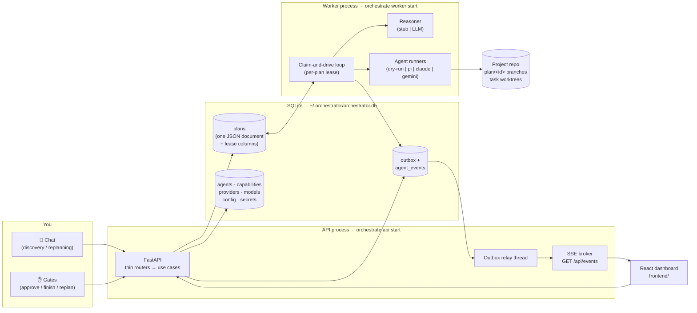
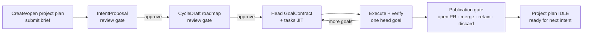

# AIPOM — Agent Orchestrator

**A local-first orchestrator that turns a project brief into an executed plan, with a human approving every consequential step.**

You describe what you want in a chat. A planning LLM (the *reasoner*) negotiates a roadmap of goals with you, breaks each goal into executable tasks just-in-time, and binds each task to a coding agent (Claude Code, Gemini CLI, or `pi`). A worker process executes tasks one at a time, each in an isolated git worktree that merges into a per-plan branch only on success. You gate the plan before execution starts and after it finishes — and you can re-plan conversationally at any point without losing history.

Everything runs on your machine: state is a single SQLite file, credentials are envelope-encrypted, and the default mode (`dry-run` + stub reasoner) exercises the entire system without any API key.



---

## Table of contents

- [How a plan flows](#how-a-plan-flows)
- [Quick start (dry-run, no API key)](#quick-start-dry-run-no-api-key)
- [Going real](#going-real)
- [Repository layout](#repository-layout)
- [CLI reference](#cli-reference)
- [Configuration](#configuration)
- [HTTP API](#http-api)
- [Testing](#testing)
- [Contributing / workflow](#contributing--workflow)
- [Documentation map](#documentation-map)
- [Project status](#project-status)

---

## How a plan flows

Each project owns one long-lived plan. Finite work lives in cycles, and the root reports `running | paused | waiting | blocked | idle`; it never terminates. Chat proposes intent, the worker plans and executes one strict head goal at a time, and exact-revision human gates approve intent, roadmap, and publication.



Key mechanics, each explained in depth in [`docs/architecture/`](docs/architecture/):

- **Project-aware discovery** — create or reopen the project's sole plan; the submitted brief is persisted before the reasoner call and visible in chat. A normalized intent either asks focused questions or opens an exact-revision review gate.
- **Cyclic JIT planning** — approved intent becomes a stable-key/dependency roadmap. Only the earliest goal receives a frozen contract and tasks; a crash resumes from durable artifacts and planning-operation records.
- **Strict execution + verification** — the head goal is an ordering barrier. Task candidates are independently verified before goal/cycle promotion, and no later task runs past backoff or a block.
- **Provider-aware recovery** — normalized failures honor Retry-After, use jittered durable backoff, and persist runtime/provider/model circuits. Exhaustion opens a structured block with legal recovery actions.
- **Truthful operations** — the console hydrates task → run → attempt history over HTTP before SSE. Metrics distinguish planner, child, and combined usage and never turn unavailable counters into zero.
- **Git staging follows ownership** — task/run → goal → cycle branches; only verified work promotes upward, and publication records exactly one output disposition.

## Quick start (dry-run, no API key)

Requires Python 3.11+ and Node 18+.

```bash
# 1. Backend install + database
cd backend
uv pip install -e .[dev]                       # or: pip install -e .[dev]
python -m src.infra.cli.main db upgrade        # DB under ORCHESTRATOR_HOME (default ~/.orchestrator)
python -m src.infra.cli.main seed demo --stub  # capabilities, default agent, stub reasoner config

# 2. Two processes (separate terminals)
python -m src.infra.cli.main api start --port 8000
python -m src.infra.cli.main worker start

# 3. Frontend
cd ../frontend
npm install && npm run dev                     # http://localhost:5173
```

> **After every pull, re-run `python -m src.infra.cli.main db upgrade` before seeding or starting the API/worker.** `seed demo` and the processes assume the schema is at head — they do not migrate. A DB left on an older revision fails with a cryptic `sqlite3.OperationalError: no such column: …` (e.g. `agents.runtime_type`, added by migration `0004_agent_runtime`). The fix is always `db upgrade`.

Create/open a project plan in the UI, submit a brief, then drive the stub reasoner's deterministic discovery grammar:

| You type | What happens |
|---|---|
| `ask: anything` | The reasoner replies with a question — the conversation stays open |
| any concrete brief | The reasoner normalizes it into an intent proposal for review; approval lets the worker draft the cycle roadmap |

Approve the intent and roadmap, watch JIT goal execution live, then choose the publication disposition. The same project plan returns to idle for the next cycle.

## Going real

Two independent switches, both stored in SQLite config (not env vars):

**1. Real planning LLM** (the reasoner):

```bash
export ORCHESTRATOR_MASTER_KEY=$(python -c "from cryptography.fernet import Fernet; print(Fernet.generate_key().decode())")
export OPENROUTER_API_KEY=sk-...
python -m src.infra.cli.main seed demo --provider openrouter \
    --model anthropic/claude-sonnet-4-5 --api-key-env OPENROUTER_API_KEY
```

`seed demo` stores the key envelope-encrypted, creates the provider/model rows, and sets `reasoner.mode=llm`. Presets exist for `openai | openrouter | anthropic | gemini | local`.

**2. Real task execution** (the agent runner):

```bash
python -m src.infra.cli.main config set agent_runner.mode real
export PROJECT_REPO_DIR=/path/to/the/repo/agents/should/work/on
```

In `real` mode each task resolves **per run** through the agent registry: the bound `AgentSpec.runtime_type` (`pi` default | `claude` | `gemini` | `dry-run`) picks the CLI runtime, and its `provider_id`/`model_id` catalog rows supply the decrypted key and model string. Edit agents or rotate keys at runtime — no restart needed. `GET /api/runner/status` reports mode, per-agent binding validity, and binary probes; the worker warns at boot about missing CLIs.

> The two switches are orthogonal: stub reasoner + real runner, or LLM reasoner + dry-run execution, are both valid (and useful) combinations. Neither dry-run path ever touches the secret store, so no master key is needed until you go real.

## Repository layout

```text
agent-orchestrator/
├── README.md                ← you are here
├── ROADMAP.md               ← everything planned but not yet implemented
├── CLAUDE.md                ← invariants + rules for AI-assisted contributions
├── docs/                    ← system documentation (see the map below)
│   ├── architecture/        ← how it works, with diagrams (per-subsystem)
│   ├── decisions/           ← ADRs + the consolidated decision log
│   ├── legacy/              ← pre-refactor features preserved for possible reintroduction
│   └── history/             ← archived plans, analyses, and pre-refactor docs
├── backend/
│   ├── src/
│   │   ├── domain/          ← FROZEN core: Plan aggregate, 9-phase machine, ports (README inside)
│   │   ├── app/             ← use cases + phase handlers + worker loop (README inside)
│   │   ├── infra/           ← SQLite, git workspace, CLI runners, reasoner, container (README inside)
│   │   └── api/             ← FastAPI: thin routers, SSE, outbox relay (README inside)
│   ├── tests/               ← dual-backend truth tests + integration (README inside)
│   ├── alembic/             ← migrations 0001_core … 0004_agent_runtime
│   └── docs/                ← INTEGRATION_GUIDE.md — the frozen port contracts
└── frontend/                ← React 18 + Vite dashboard (README inside)
```

## CLI reference

Entry point: `python -m src.infra.cli.main` (or `orchestrate` once installed). All commands run from `backend/`.

| Command | Purpose |
|---|---|
| `db upgrade` | Apply Alembic migrations to the DB under `ORCHESTRATOR_HOME`. Run it after every pull, before `seed demo`/`api start`/`worker start` — a stale schema fails with `no such column: …` |
| `api start [--host] [--port]` | Serve the API (runs the outbox→SSE relay in-process) |
| `worker start [--worker-id] [--poll-seconds] [--lease-seconds]` | Run the claim-and-drive worker loop |
| `seed demo [--stub \| --provider … --model … --api-key-env …]` | Idempotently seed capabilities, the default agent, provider/model rows, and reasoner config |
| `config get\|set\|list [scope]` | Read/write the two-tier config store (scope `orchestrator` or a project id) |
| `plan list` / `plan show <id>` | Inspect plans from the terminal |

### Offline plan-run export

<code>backend/scripts/export_plan_runs.py</code> is a standalone, read-only
reporting tool; it is not registered with the API, worker, application container,
or domain. From the repository root, write the backwards-compatible complete JSON
snapshot:

~~~bash
python backend/scripts/export_plan_runs.py \
  --output plan-runs.json \
  --pretty
~~~

For streaming analysis, write an atomic timestamped bundle under an explicit
operator-owned directory:

~~~bash
python backend/scripts/export_plan_runs.py \
  --format bundle \
  --output-dir ~/.orchestrator/exports/plan-runs
~~~

The bundle contains a hashed <code>manifest.json</code>, sanitized referenced
<code>catalog.json</code>, <code>comparisons.json</code>, and separate JSONL
streams for plans, planning operations, runs, attempts, telemetry, summaries,
metrics, insights, domain events, chat, and runtime circuits.
Provider/model/runtime comparisons report outcomes, retries, failure kinds, token
coverage, and end-to-end operation duration. Duration is not claimed as provider
HTTP latency because that measurement is not persisted.

For a focused debugging capture, reuse the same exporter core:

~~~bash
python backend/scripts/snapshot_current_plan.py \
  --project-id PROJECT_ID \
  --output current-plan.json \
  --pretty
~~~

<code>--plan-id</code> selects an exact plan. With no selector, the snapshot
command chooses the sole plan or sole non-idle plan; it fails with candidate IDs
when selection is ambiguous. Both commands read
<code>$ORCHESTRATOR_HOME/orchestrator.db</code> by default and accept
<code>--db PATH</code>. JSON remains on stdout unless an output is explicit.
SQLite is opened with <code>mode=ro</code>,
<code>PRAGMA query_only=ON</code>, and one snapshot transaction.

Reports include plan state, operations, attempts, correlated and unassigned
telemetry, truthful metrics, labelled insights, execution summaries, domain
events, chat context, and current referenced catalog labels. Catalog projection is
field-allowlisted: API-key references, provider base URLs, agent instructions, and
retry configuration are never exported; unrelated catalog entries are omitted.
Plan/chat/runtime evidence can still be project-sensitive, so handle exports
accordingly.

## Configuration

**Environment variables** — read *only* in the composition root (`backend/src/infra/container.py`) and the API server:

| Variable | Default | Purpose |
|---|---|---|
| `ORCHESTRATOR_HOME` | `~/.orchestrator` | State directory (SQLite DB, default workspace repo) |
| `ORCHESTRATOR_MASTER_KEY` | unset | Fernet key wrapping the secret store. Only needed when a real provider key must be decrypted — dry-run/stub never ask for it |
| `PROJECT_REPO_DIR` | `<home>/workspace-repo` | The git repo task agents work on (auto-seeded if absent) |
| `ORCHESTRATOR_API_TOKEN` | unset | Control-plane bearer token; the API is open when unset |
| `CORS_ALLOW_ORIGINS` | Vite dev origins | Comma-separated allowed origins |
| `REASONER_SMOKE_API_KEY` (+`_BASE_URL`, `_MODEL`) | unset | Enables the cost-gated real-LLM smoke test only |

**SQLite config keys** (scope `orchestrator`) — runtime behavior lives here, *not* in env vars. There is no `AGENT_MODE` anymore:

| Key | Default | Purpose |
|---|---|---|
| `reasoner.mode` | `stub` | `stub` \| `llm` — which planning reasoner the factory builds |
| `reasoner.provider_id` / `reasoner.model_id` | — | Catalog rows the LLM reasoner resolves (required in `llm` mode; invalid config fail-fasts as `REASONER_CONFIG_INVALID` → HTTP 422) |
| `reasoner.temperature` / `reasoner.max_turns` | `0.2` / `8` | Agent-loop tuning |
| `agent_runner.mode` | `dry-run` | `dry-run` \| `real` — global task-execution mode |
| `agent_runner.timeout_seconds` | `600` | Per-attempt subprocess timeout |

## HTTP API

Thin routers map 1:1 onto use cases; domain errors bubble to one code→status table (`backend/src/api/exceptions.py`). Highlights (full mapping in [`backend/docs/INTEGRATION_GUIDE.md`](backend/docs/INTEGRATION_GUIDE.md)):

| Route | Purpose |
|---|---|
| `POST /api/plans` (+ `Idempotency-Key`) | Create or reopen the project's long-lived plan and automatically analyze the submitted brief |
| `POST /api/plans/{id}/discovery/message` · `/replanning/message` | Persisted brief/chat turn → questions or a normalized intent proposal |
| `GET /api/plans/{id}` · `/chat` · `/attempts` | Aggregate/status/progress · persisted conversation · planning/task/run/attempt timeline |
| `/intent` · `/intent/approve` · `/cycle-draft` · `/cycle-draft/approve` · `/publication` | Versioned artifact review and publication commands |
| `POST /api/plans/{id}/pause` · `/resume` · `/retry` | Graceful pause, resume-only, and targeted retry/block recovery |
| `POST /api/plans/{id}/edits` | Surgical structural edits (add/remove/reorder tasks, requirements, agent rebind) |
| `/api/agents · /capabilities · /providers · /models · /projects` | Reference-data CRUD (delete-guarded against live references) |
| `GET /api/reasoner/status` · `/api/runner/status` | Config validity, bindings, binary probes |
| `GET /api/events` | SSE stream — named domain events + `agent.event` telemetry, at-least-once, dedup on `event_id` |

## Testing

```bash
cd backend
make check                    # ruff + mypy (zero errors, no excludes) + pytest
pytest -m "not integration"   # fast unit suite
pytest -m integration         # real SQLite, real git repos, API TestClient
pytest -m llm                 # cost-gated real-provider smoke (needs REASONER_SMOKE_API_KEY)
```

The suite's centerpiece is the **truth test**: the entire orchestration suite runs twice — against in-memory fakes *and* against the real SQLite `UnitOfWork` — via one parametrized fixture. Crash-recovery, outbox-rollback, and backoff-survives-crash passing on real SQLite is the proof that transactional atomicity is real, not simulated. See [`backend/tests/README.md`](backend/tests/README.md).

## Contributing / workflow

All human and agent changes use short-lived branches and pull requests into
`main`. PR titles follow Conventional Commits, required CI must pass, and
release-please turns the resulting squash-merge history into versioned releases.
See [`docs/git-flow.md`](docs/git-flow.md) for branch names, commit conventions,
hotfixes, and the release process.

Use [`backend/scripts/dev.sh`](backend/scripts/dev.sh) as the structured local
entry point for preflight, locked setup, stub or explicit-provider seeding,
supervised startup, and CI-parity checks. Its parameter and security contract is
documented in [`docs/development.md`](docs/development.md).

Repository-aware Codex workflows are bundled in
[`plugins/agent-orchestrator-codex/`](plugins/agent-orchestrator-codex/). Install
that local plugin in Codex to use its seven skills, deterministic helper tools,
and impact/core/adapter/verification agent profiles. The `Codex plugin` CI job
validates their structure and safe read-only checks.

```bash
codex plugin marketplace add .
codex plugin add agent-orchestrator-codex@personal
```

---

## Documentation map

| Where | What |
|---|---|
| [`docs/README.md`](docs/README.md) | Index of all documentation |
| [`docs/architecture/`](docs/architecture/) | Per-subsystem deep dives with diagrams: overview, plan lifecycle, execution model, events/observability, data model, frontend, known issues |
| [`docs/decisions/`](docs/decisions/) | ADRs and the consolidated decision log (why things are the way they are) |
| [`docs/development.md`](docs/development.md) | Parameterized local setup, seeding, startup, and verification workflow |
| [`docs/legacy/pre-refactor-backend.md`](docs/legacy/pre-refactor-backend.md) | Features the old backend had (PR gate, project spec governance, decision gate, …) preserved for reintroduction analysis |
| [`docs/history/`](docs/history/) | Archived planning documents and debugging analyses — the project's paper trail |
| [`ROADMAP.md`](ROADMAP.md) | Everything designed or planned but not yet implemented, prioritized |
| [`CLAUDE.md`](CLAUDE.md) | The contract for AI-assisted changes: invariants, commands, style |

## Project status

The system is a **working prototype past its core-integration milestone**: the nine-phase machine, the conversational reasoner (stub + OpenAI-compatible LLM), catalog-driven runtime resolution, the git-worktree workspace, live SSE, and the full-cycle test walk are all in place, with `mypy` at zero errors and the truth-test suite green. Known operational defects (verified, with reproduction notes) are tracked in [`docs/architecture/known-issues.md`](docs/architecture/known-issues.md) and scheduled in [`ROADMAP.md`](ROADMAP.md) — the two most important: the default lease/timeout combination permits double execution of long tasks under multiple workers, and a poisoned plan can starve a single-worker deployment.
