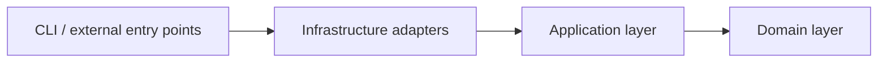

# Architecture overview

This repository currently follows a layered architecture with explicit boundaries between domain rules, application orchestration, and infrastructure adapters.

## Layer map

### Domain layer — `src/domain`

The domain layer owns the system's business rules and state transitions.

It includes:

- **Aggregates** such as tasks, goals, planner sessions, and project plans.
- **Entities and value objects** for agents, execution state, PR state, statuses, and goal metadata.
- **Repository and service ports** that define the contracts used by the application layer.
- **Domain services and rules** such as scheduling, reconciliation, and task rule evaluation.
- **Project spec domain models** for validating architecture constraints and spec changes.

The domain layer should not depend on concrete filesystem, Redis, subprocess, git, or HTTP implementations.

### Application layer — `src/app`

The application layer coordinates workflows using domain objects and ports.

It currently contains:

- **Use cases** for task execution, retries, project reset, goal initialization/finalization, PR synchronization, spec validation, and spec change proposals.
- **Handlers** for the task manager and worker processes.
- **Reconciliation services** that detect expired leases, stuck tasks, and similar operational drift.
- **Planning orchestration** that drives discovery, architecture, and phase review workflows.
- **Goal orchestration** in `src/app/orchestrator.py`, which reacts to task and goal events to manage branch-level progress and PR-driven gating.

Application code is the bridge between domain decisions and infrastructure side effects.

### Infrastructure layer — `src/infra`

The infrastructure layer implements ports and wires the application together.

Key areas include:

- **CLI** commands in `src/infra/cli`
- **Filesystem repositories** in `src/infra/fs`
- **Redis adapters** for events and leases in `src/infra/redis_adapters`
- **Git workspace adapters** in `src/infra/git`
- **Runtime adapters** in `src/infra/runtime`
- **GitHub integration** in `src/infra/github`
- **Configuration and project-path derivation** in `src/infra/config.py`, `src/infra/config_manager.py`, `src/infra/project_paths.py`, and `src/infra/project_settings.py`
- **Observability** in `src/infra/logging` and `src/infra/logs_and_tests.py`

### Composition root — `src/infra/factory.py`

The factory module is the composition root. It chooses concrete adapters based on configuration and injects them into handlers and use cases.

## Dependency direction



The important rule is not the mermaid arrow style but the code dependency rule:

- `src/domain` should stay independent.
- `src/app` may depend on `src/domain`.
- `src/infra` may depend on both `src/app` and `src/domain`.

## Runtime state model

The current implementation is project-scoped. The active project is derived from `ORCHESTRATOR_HOME` and `PROJECT_NAME`, and `ProjectPaths` maps that into a stable directory layout.

```text
<orchestrator_home>/projects/<project_name>/
  agents/registry.json
  events/
  goals/
  logs/
  planner_sessions/
  project.json
  project_plan.yaml
  project_spec.yaml
  project_state/
  repo/
  tasks/
  workspaces/
```

This design separates three kinds of configuration/state:

- **Machine-local orchestrator config** in `.orchestrator/config.json`
- **Project operational settings** in `project.json`
- **Project architecture constraints** in `project_spec.yaml`

## Major runtime workflows

### 1. Task lifecycle

1. A task is created through the task CLI or a higher-level goal/planning use case.
2. The task manager reacts to `task.created` or `task.requeued`.
3. The scheduler selects an active compatible agent.
4. The task is assigned and a lease is created.
5. A worker consumes `task.assigned`, prepares a workspace, builds the correct runtime, and executes the task.
6. The result is persisted and emitted as task events.
7. The reconciler can requeue or fail stale work when leases expire or workers disappear.

### 2. Goal lifecycle

1. A goal definition is loaded and expanded into multiple tasks.
2. Goal state is persisted separately from task state.
3. The goal orchestrator listens to task events.
4. Successful task completion triggers branch merge logic into the goal branch.
5. When all goal tasks are merged, the system can emit `goal.ready_for_review`.
6. Optional GitHub PR creation and PR-state polling drive approval/merge-based progress.
7. Finalization merges the completed goal branch into the configured base branch.

### 3. Planning lifecycle

The planning subsystem is no longer just a simple roadmap generator. It persists and advances a structured project plan:

- **Discovery** captures a project brief and open questions.
- **Architecture** proposes decisions, spec changes, and phased execution.
- **Phase review** records lessons learned and proposes the next phase.

This planning state is stored through the project plan repository and linked to downstream goals/spec updates.

### 4. Spec governance

The spec flow is intentionally controlled:

- show current spec
- validate proposed work against the spec
- stage a proposal
- diff proposal vs live spec
- apply the proposal only through an explicit operator step

This prevents agents from silently mutating architectural constraints during execution.

## Events and coordination

The runtime uses event-driven coordination for long-running processes.

Examples of events handled today include:

- task events such as creation, assignment, completion, failure, cancellation, and requeueing
- goal review events such as `goal.ready_for_review`, `goal.approved`, and `goal.merged`

Redis-backed adapters are used in real mode. In-memory adapters are used in dry-run mode and tests.

## Observability

Observability is already part of the current system rather than a future concept.

Implemented mechanisms include:

- **event journaling** in the project `events/` directory
- **runtime log wrapping** for all agent runtimes
- **filesystem task logs** for execution output
- **CLI and handler logging** via `structlog`

## Current extension points

If you are extending the system, these are the preferred seams:

- add new business rules in `src/domain`
- add orchestration flow in `src/app/usecases` or `src/app/handlers`
- add new adapters in `src/infra`
- update the factory to wire new infrastructure
- keep spec-related write paths constrained to the explicit proposal/apply flow

## Architecture notes on the current state

Compared with earlier iterations of the project, the codebase has already moved beyond a task-only prototype:

- goals are first-class aggregates
- project planning is persisted and phase-based
- project specs are validated and versioned through proposals
- GitHub PR state is part of the broader orchestration model
- logging and event persistence are integrated into runtime execution

That broader orchestration model is what the current documentation should assume.
