# The data model

*One SQLite file holds everything. The plan is a document; the catalogs are relational; secrets are envelope-encrypted.*

Code anchors: `backend/src/infra/db/tables.py` (schema), `engine.py` (PRAGMAs), `plan_repository.py` (document + lease), `execution_record_repository.py` (run/attempt ledger), `observation_repository.py` (typed operational evidence), `reference_repos.py` (catalog CRUD + integrity), `secret_store.py` (encryption), `backend/alembic/versions/` (the migration chain, currently through `0008_typed_observations`).

## Schema at a glance

```mermaid
erDiagram
    plans {
        string id PK
        int version "optimistic-lock CAS"
        string phase "promoted for the claim query"
        int iteration
        text data "THE AGGREGATE - one JSON document"
        string claimed_by "lease"
        int lease_expires_at "epoch seconds"
        string updated_at "claim ordering"
    }
    plan_requests {
        string request_id PK "create idempotency"
        string plan_id FK
    }
    outbox {
        int id PK
        string event_id UK "consumer dedup key"
        string plan_id
        string type
        text payload
        string delivered_at "NULL = undelivered (partial index)"
    }
    execution_runs {
        string id PK "stable logical run id"
        string plan_id FK
        string goal_id
        string task_id
        string status "running | retrying | succeeded | failed | abandoned"
        string started_at
        string completed_at
    }
    execution_attempts {
        string id PK "unique invocation id"
        string run_id FK
        string plan_id FK
        string goal_id
        string task_id
        int number "monotonic over task lifetime"
        int task_attempt "domain retry-counter snapshot"
        string status "running | succeeded | failed | abandoned"
        string started_at
        string completed_at
    }
    agent_events {
        int id PK "relay cursor"
        string event_id UK "observation id / legacy dedup"
        string plan_id
        string goal_id
        string task_id
        string run_id
        string attempt_id
        int attempt "legacy/task-lifetime compatibility"
        int seq "legacy compatibility"
        string observation_kind
        string source
        string quality
        int schema_version
        int source_sequence
        text payload "allowlisted typed or legacy JSON"
        string occurred_at "observed time"
        string recorded_at
    }
    plan_chat_messages {
        int id PK
        string plan_id FK
        string role "user | assistant"
        text content
        text meta "committed flag"
    }
    agents {
        string id PK
        string runtime_type "pi | claude | gemini | dry-run"
        string provider_id "NOT FK-constrained (see note)"
        string model_id
        int is_default
        text default_retry "RetryPolicy JSON"
    }
    capabilities {
        string id PK
        text tools "JSON list"
    }
    agent_capabilities {
        string agent_id PK,FK "CASCADE"
        string capability_id PK,FK "RESTRICT"
    }
    providers {
        string id PK
        string base_url
        string api_key_ref "secret URI - NEVER plaintext"
    }
    models {
        string id PK
        string provider_id FK "CASCADE down"
    }
    secrets {
        string uri PK
        text ciphertext
        text wrapped_key "envelope encryption"
    }
    config {
        string scope PK "orchestrator | project id"
        string key PK
        text value
    }
    projects {
        string id PK
        string repo_url
    }

    plans ||--o{ plan_requests : "idempotency"
    plans ||--o{ execution_runs : "operational lifecycle"
    plans ||--o{ execution_attempts : "correlation"
    execution_runs ||--o{ execution_attempts : "invocations"
    plans ||--o{ plan_chat_messages : "conversation"
    agents ||--o{ agent_capabilities : ""
    capabilities ||--o{ agent_capabilities : ""
    providers ||--o{ models : "cascade"
```



## The plan-as-document decision

The `Plan` aggregate — goals, tasks, results, retry policy, everything — is stored as **one JSON document** in `plans.data`. Scalar columns are promoted *only* for what SQL must predicate on: the claim query (`phase` + lease columns), the version CAS, and cheap listings (`updated_at`, `iteration`). There is no ORM mapping of the domain; repositories do JSON in / JSON out via `PlanFactory.reconstruct`.

`execution_runs` and `execution_attempts` are deliberately outside that document. They are operational application records, not aggregates: a logical run spans automatic retries, while every actual invocation gets a UUID attempt plus a task-lifetime monotonic number. A human retry starts a new run without reusing the workspace attempt number.

`agent_events` is the compatibility physical stream for both typed operational observations and legacy runtime events. Typed rows use `event_id` as the stable observation ID and retain provenance, quality, schema version, observed/recorded times, and optional run/attempt correlation. Legacy rows are preserved and marked `legacy_unknown`; nullable metadata permits rolling compatibility with older writers.

What this buys, and what it costs:

- ✅ **Detached aggregates for free** — every `get()` parses fresh JSON; a returned `Plan` can never alias stored state. The in-memory fake and the real repository behave identically, which is what makes the dual-backend truth tests meaningful.
- ✅ **One write gate** — the plan-level version CAS is the single concurrency control; there is no cross-table consistency to reason about inside an aggregate.
- ⚠ **Write amplification** — every task transition rewrites the whole document, and SQLite has one writer. Fine at current scale; this is the pressure point if task counts grow 10x (see the evolution plan's stress tests).

### The version CAS (optimistic concurrency)

Use cases call `plan.bump_version()` *then* `uow.plans.save(plan)`. The save is a single upsert whose UPDATE arm fires only when `plans.version < excluded.version`; rowcount 0 → `StaleVersionError` → HTTP 409 (the worker-vs-human-edit race, surfaced instead of silently lost). `save()` never touches the lease columns — ownership and state travel on separate paths.

### The lease (rows as ownership)

`claim_one_unit` is one atomic `UPDATE … RETURNING` over the claim predicate (worker-claimable phase + lease NULL/expired, oldest `updated_at` first). `heartbeat`/`release` run on their own short sessions, *outside* the UnitOfWork — they're called between transactions by the worker loop. Lease times are integer epochs from the injected `Clock`, so `FakeClock.advance()` drives expiry deterministically in tests.

## Transactions — the UnitOfWork

`SqliteUnitOfWork` is **re-enterable by design**: each `with uow:` opens a *fresh* Session + transaction and commits/rolls back on exit. One drive pass enters it many times sequentially (dispatcher read, txn1, finalize txn). Plan state, execution run/attempt boundaries, and outbox rows commit **atomically** in the same open transaction. A rollback discards all three. One UoW instance per worker/request; it is not thread-safe.

Chat (`plan_chat_messages`) and operational observations deliberately do **not** use the plan UoW — each uses its own short transaction, so display/diagnostic evidence and plan truth can never roll each other back. The typed observation repository is append-only and rejects an observation ID reused for different evidence; identical replays are idempotent.

## Engine policy

Applied to **every** pooled connection via a `connect` event listener (`engine.py`):

| PRAGMA | Why |
|---|---|
| `journal_mode=WAL` | concurrent readers + one writer |
| `synchronous=FULL` | commit implies fsync — durability is the whole point of the persist-first design |
| `foreign_keys=ON` | off by default in SQLite (!) |
| `busy_timeout=5000` | writers wait instead of instantly erroring "database is locked" |

## Referential integrity — two mechanisms

1. **Schema-level** where SQLite allows: `agent_capabilities.capability_id` is `RESTRICT` (can't delete a capability an agent uses), `models.provider_id` cascades down, deleting an agent cascades its capability links.
2. **Application-level delete-guards** (`reference_repos.py`) where the reference lives inside the plan JSON document: deleting an agent/capability/provider/model referenced by a **non-terminal plan** (or bound to an agent's runtime) raises `ReferencedEntityInUseError` → HTTP 409. ⚠ The active-plan check is a JSON substring match (e.g. `'"agent_id":"…"'`) — a documented load-bearing hack; false positives merely block a delete, false negatives are impossible for exact-id matches. `agents.provider_id/model_id` are deliberately *not* FK-constrained (SQLite can't add FKs to existing tables); the runner factory's binding validation + `/api/runner/status` are the dangling-ref net.

## Secrets — envelope encryption

Each secret row stores `ciphertext` + `wrapped_key`: the value is encrypted with a per-secret data key, which is itself wrapped by the master key (`ORCHESTRATOR_MASTER_KEY`, Fernet). Catalog rows reference secrets by `api_key_ref` URI only. `resolve()` in `secret_store.py` is the single decryption point, and the store fails closed on a missing/invalid master key — which is exactly why stub/dry-run factories receive it as an *unevaluated thunk*.

## State directory

```text
~/.orchestrator/            (ORCHESTRATOR_HOME)
├── orchestrator.db         everything above (+ -wal/-shm)
└── workspace-repo/         default PROJECT_REPO_DIR if unset —
                            plan/<id> branches + task worktrees
```

One file to back up; delete the directory for a factory reset. Migrations: `python -m src.infra.cli.main db upgrade`.
