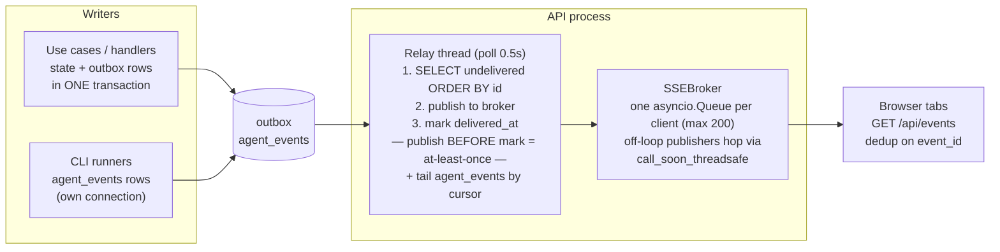

# Events & observability

*Two event streams, one delivery path; what an operator can see, and how secrets stay out of all of it.*

Code anchors: `backend/src/domain/events/` (the event types), `backend/src/infra/db/outbox.py` + `agent_event_sink.py` (the writers), `backend/src/api/outbox_relay.py` (delivery), `backend/src/api/sse.py` (fan-out), `backend/src/api/logging/` + `middleware/request_logging.py` (logs).

## The two streams

| | **outbox** (domain events) | **agent_events** (runtime telemetry) |
|---|---|---|
| Granularity | Coarse: `PhaseAdvanced`, `TaskStarted/Completed/Requeued/FailedEvent/Abandoned`, `GoalCompleted/GoalFailedEvent`, `PlanCompleted/PlanFailed`, `ReplanRequested`, `AgentFellBackToDefault` | Fine: `agent.started` / `agent.finished` / `agent.failed` per attempt (streaming tool-call events are a roadmap seam — `seq` is currently just 0/1) |
| Written | **Inside the state transaction** (`uow.outbox.add` + `uow.plans.save` commit together) — an event exists iff its state change committed | Best-effort, own connection, **never** inside the plan transaction; `INSERT OR IGNORE` dedup on `event_id` |
| Payloads | Minimal — IDs + tiny metadata; consumers refetch state | Attempt-tagged runtime facts (runtime, cwd, elapsed, failure kind/reason) |
| Delivery marker | `delivered_at` column | Cursor kept by the relay (in memory — see caveat below) |

The split is deliberate: losing telemetry must never roll back plan state, and plan state committing must never block on a telemetry write.

## Delivery: the outbox relay → SSE

The contract, end to end:

- **Routers never publish.** Mutations only write rows; the relay is the single publisher. This is what makes "state changed but nobody was told" impossible — the row *is* the notification, durably.
- **At-least-once, dedup on `event_id`.** A crash between publish and mark re-delivers; every payload carries `event_id` and consumers (the frontend SSE bridge) drop duplicates.
- **SSE events are NAMED** (`event: <type>`), so the client registers per-type listeners; agent telemetry arrives as `agent.event`.
- **No replay for late subscribers.** A client that connects after delivery starts from "now" and refetches state over REST; a full client queue drops events with a warning (slow consumers don't stall the broker). This is a deliberate UI-feed contract, not an event-sourcing bus.

⚠ Two verified caveats live in [known-issues.md](known-issues.md): the agent-events cursor resets to 0 on API restart (full-table replay to connected clients), and no table has retention.

## Structured logging

`print()` and stdlib `logging` are banned; everything is `structlog`:

- `log = structlog.get_logger(__name__)`; event names are namespaced and action-oriented: `workspace.committed`, `worker.tick_failed`, `outbox_relay.pass_failed`, `agent_runner.resolved`.
- The API's `RequestLoggingMiddleware` binds a correlation id (`X-Request-ID`, also exposed to browsers) into a contextvar; the one error-mapping layer logs domain errors with their stable `code` and full stack traces for unhandled 500s — the client gets a generic envelope, never a trace.
- The worker logs claim/drive/release transitions and warns at boot (real mode) about missing runtime binaries (`dependency_checker.py`).

## What an operator can see today

| Question | Answer surface |
|---|---|
| What phase is every plan in? Who holds the lease? | `GET /api/plans` (promoted columns — cheap, no document parse) |
| The full state of one plan | `GET /api/plans/{id}` — the entire aggregate document |
| What's happening right now | `GET /api/events` SSE — domain events + live agent start/finish |
| Is the runtime wired correctly? | `GET /api/runner/status` (mode, per-agent binding validity, binary probes) · `GET /api/reasoner/status` |
| What did the user and reasoner say? | `GET /api/plans/{id}/chat` |

**Known blind spots** (scheduled in [ROADMAP.md](../../ROADMAP.md) "Next"): per-attempt history (a requeue erases the failed result — the trail survives only in outbox payloads), failed attempts' stdout beyond `reason[-500:]`, worker liveness as a first-class surface, metrics of any kind, and the task→git-branch mapping.

## Secrets hygiene

Three rules, enforced at the choke points:

1. Keys live **envelope-encrypted** in the `secrets` table; catalog rows carry only `api_key_ref` URIs.
2. `SqliteSecretStore.resolve()` is the **single decryption point**; the store is passed to factories as a thunk so stub/dry-run modes never construct it (it fails closed on a missing `ORCHESTRATOR_MASTER_KEY`).
3. Never log key material: domain-error `context` is log-safe by contract, and telemetry payloads carry refs, not values.
