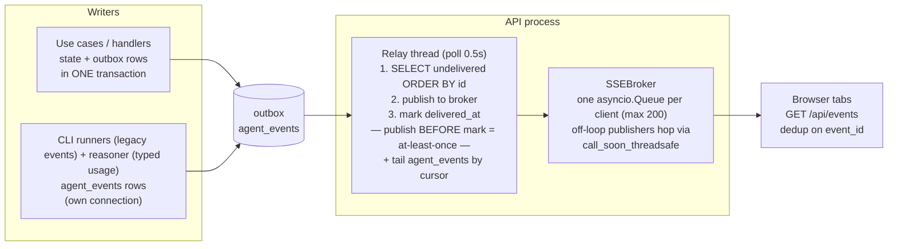

# Events & observability

*Two event streams, one operational execution ledger, and one delivery path; what an operator can see, and how secrets stay out of all of it.*

Code anchors: `backend/src/domain/events/` (domain event types), `backend/src/app/execution_records.py` (operational lifecycle), `backend/src/app/observations.py` (typed evidence), `backend/src/infra/db/execution_record_repository.py` + `observation_repository.py` (persistence), `backend/src/infra/db/outbox.py` + `agent_event_sink.py` (event writers), `backend/src/api/outbox_relay.py` (delivery), and `backend/src/api/logging/` (logs).

## The two streams

| | **outbox** (domain events) | **agent_events** (operational observations + legacy runtime events) |
|---|---|---|
| Granularity | Coarse: `PhaseAdvanced`, `TaskStarted/Completed/Requeued/FailedEvent/Abandoned`, `GoalCompleted/GoalFailedEvent`, `PlanCompleted/PlanFailed`, `PlanPaused/PlanResumed`, `ReasonerFailed`, `ReplanRequested`, `AgentFellBackToDefault` | Typed `model.usage` observations plus compatible `agent.started` / `agent.finished` / `agent.failed` legacy events (streaming tool-call observations remain a roadmap seam) |
| Written | **Inside the state transaction** (`uow.outbox.add` + `uow.plans.save` commit together) — an event exists iff its state change committed | Own short transaction, **never** inside the plan transaction. Typed observations use conflict-detecting idempotent append; the legacy sink retains best-effort `INSERT OR IGNORE` behavior |
| Payloads | Minimal — IDs + tiny metadata; consumers refetch state. `TaskRequeued`/`TaskFailedEvent` carry the `FailureKind`; `PlanPaused` carries `auto` (system vs human) | Canonical rows carry kind, source, quality, schema version, observed/recorded times, optional run/attempt correlation, and an allowlisted typed payload. Legacy rows are explicitly `source=legacy`, `quality=legacy_unknown`, `schema_version=0` |
| Delivery marker | `delivered_at` column | Cursor kept by the relay (in memory — see caveat below) |

The split is deliberate: losing telemetry must never roll back plan state, and plan state committing must never block on a telemetry write.

## The execution ledger is not a third event stream

`execution_runs` and `execution_attempts` are current operational lifecycle rows, not domain events and not best-effort telemetry. Transaction 1 creates or reuses a logical run and creates the concrete invocation attempt in the same UoW as `TaskStarted` and the task state change. A retryable failure closes the attempt as FAILED and leaves the run RETRYING; success, terminal failure, or tolerant abandonment closes both. Unexpected exceptions leave a RUNNING attempt that recovery tooling can query later.

This ledger supplies stable `run_id`/`attempt_id` correlation and a task-lifetime monotonic attempt number. `GET /api/plans/{id}/attempts` exposes planning operations and task → run → attempt history for HTTP hydration before SSE. It does not replace `agent_events`; correlated runtime events supplement the durable ledger.

## Delivery: the outbox relay → SSE

The contract, end to end:

- **Routers never publish.** Mutations only write rows; the relay is the single publisher. This is what makes "state changed but nobody was told" impossible — the row *is* the notification, durably.
- **At-least-once, dedup on `event_id`.** A crash between publish and mark re-delivers; every payload carries `event_id` and consumers (the frontend SSE bridge) drop duplicates.
- **SSE events are NAMED** (`event: <type>`), so the client registers per-type listeners; agent telemetry arrives as `agent.event`.
- **No replay for late subscribers.** A client that connects after delivery starts from "now" and refetches state over REST; a full client queue drops events with a warning (slow consumers don't stall the broker). This is a deliberate UI-feed contract, not an event-sourcing bus.

⚠ Two verified caveats live in [known-issues.md](known-issues.md): the agent-events cursor resets to 0 on API restart (full-table replay to connected clients), and no table has retention.

## Structured logging

`print()` and stdlib `logging` are banned; everything is `structlog`:

- `log = structlog.get_logger(__name__)`; event names are namespaced and action-oriented: `workspace.committed`, `worker.tick_failed`, `outbox_relay.pass_failed`, `agent_runner.resolved`.
- The API's `RequestLoggingMiddleware` binds a correlation id (`X-Request-ID`, also exposed to browsers) into a contextvar; the one error-mapping layer logs domain errors with their stable `code` and full stack traces for unhandled 500s — the client gets a generic envelope, never a trace.
- The worker logs claim/drive/release transitions and warns at boot (real mode) about missing runtime binaries (`dependency_checker.py`).

## What an operator can see today

| Question | Answer surface |
|---|---|
| What phase is every plan in? Who holds the lease? | `GET /api/plans` (promoted columns — cheap, no document parse) |
| The full state of one plan | `GET /api/plans/{id}` — the entire aggregate document |
| What's happening right now | `GET /api/events` SSE — domain events + live agent start/finish |
| Which planning/runtime operations ran or failed? | `GET /api/plans/{id}/attempts` — planning operations plus task → run → attempt evidence, including liveness, provider/model, retry and safe bounded output |
| Is the runtime wired correctly? | `GET /api/runner/status` (mode, per-agent binding validity, binary probes) · `GET /api/reasoner/status` |
| What did the user and reasoner say? | `GET /api/plans/{id}/chat` |
| A plan's agent/reasoner telemetry history | `GET /api/plans/{id}/agent-events?task_id=&limit=` — durable, most-recent-first, optionally per task (the console/DetailPanel live tail plus reload-survivable history) |
| LLM token spend + agent run/failure counts | `GET /api/metrics?plan_id=` — planner/child/combined scopes, reported/estimated/unavailable coverage, and exact attempt failures grouped by kind |
| Offline evidence for every plan and execution run | <code>python backend/scripts/export_plan_runs.py --format bundle --output-dir DIR</code> — an atomic, hashed JSON/JSONL snapshot with telemetry, metrics, comparisons, insights, and execution summaries |
| Focused current-plan debugging snapshot | <code>python backend/scripts/snapshot_current_plan.py --project-id ID --pretty</code> — the same read-only evidence core restricted to one deterministically selected plan |

**Reasoner usage observations:** `OpenAIChatClient` reads provider `response.usage`; `run_tool_session` sums it across turns; `OpenAIReasoner` appends one plan-scoped, provider-sourced `model.usage` observation per successful session. The physical row retains legacy `type=llm.call` so the existing relay, history endpoint, and metrics query continue working. Reported counters use quality `reported`; omitted provider usage is stored as nullable counters with quality `unavailable` and reason `provider_did_not_report_usage`, never fabricated as zero in the canonical record. Observation failure is logged and isolated from planning. Failed sessions and CLI-agent usage remain uncovered.

`GET /api/metrics` reads typed `model.usage` observations. Missing counters remain unavailable rather than becoming zero; source, quality, and coverage counts make reported versus estimated data explicit. Pi builds that emit NDJSON contribute an allowlisted tool/step/usage vocabulary. Providers that do not report usage, run→Git reporting, and retention remain coverage gaps rather than fabricated facts.

## Offline read-only export

<code>backend/scripts/export_plan_runs.py</code> and
<code>backend/scripts/snapshot_current_plan.py</code> are deliberately outside
<code>src/</code>. The exporter core has no imports from application, domain,
runtime, SQLAlchemy, API, or worker code. It opens SQLite with URI
<code>mode=ro</code>, enables <code>query_only</code>, and reads all included
tables in one transaction so a live WAL database produces one consistent
snapshot. It never calls an API or constructs <code>AppContainer</code>; writes
are limited to stdout or explicit report paths.

The versioned single JSON report contains every selected plan row and aggregate;
planning operations; logical execution runs with attempts and correlated
<code>agent_events</code>; plan-scoped or unassigned telemetry; outbox events;
chat; referenced circuits; truthful usage/attempt metrics; execution summaries;
and labelled insights. Correlation tries explicit <code>run_id</code>, then
<code>attempt_id</code>, then a unique
<code>(goal_id, task_id, attempt number)</code> legacy match. The export records
the method, and ambiguous evidence stays unassigned.

<code>--format bundle --output-dir DIR</code> atomically publishes a timestamped
directory. Its manifest records source/totals plus SHA-256 and record counts for
separate JSONL plan, operation, run, attempt, telemetry, summary, metric, insight,
event, chat, and circuit streams. Catalog and comparison documents remain JSON. A
failed write removes the temporary directory instead of exposing a partial bundle.

The sanitized catalog contains only entries referenced by selected plan evidence.
Providers expose <code>id</code>/<code>name</code>; models expose
<code>id</code>/<code>provider_id</code>/<code>name</code>; agents expose
identity, role, runtime/model binding, default status, and capability IDs.
Provider base URLs and API-key references plus agent instructions and retry
configuration are named in the redaction policy but never exported. Catalog values
are current reference data, not immutable historical bindings.

Comparisons group planning operations and attempts by runtime/provider/model,
including outcome, retries, failure kinds, request/tool counts, and duration
distributions. Duration is explicitly end-to-end orchestrator wall-clock evidence,
not provider HTTP latency. Usage comparisons use provider/model identity reported
by telemetry rather than guessing from mutable catalogs. Attempts do not persist
<code>agent_id</code>, so the exporter does not claim historical
agent-performance attribution.

The snapshot CLI reuses this exact core. <code>--plan-id</code> selects directly;
<code>--project-id</code> uses the one-plan-per-project invariant. Without a
selector it chooses the sole plan or sole non-idle plan and fails on ambiguity.
Stored plan content, chat, safe messages, and bounded stdout/stderr tails remain
project-sensitive even though secrets and unrelated catalogs are excluded.

## Secrets hygiene

Three rules, enforced at the choke points:

1. Keys live **envelope-encrypted** in the `secrets` table; catalog rows carry only `api_key_ref` URIs.
2. `SqliteSecretStore.resolve()` is the **single decryption point**; the store is passed to factories as a thunk so stub/dry-run modes never construct it (it fails closed on a missing `ORCHESTRATOR_MASTER_KEY`).
3. Never log key material: domain-error `context` is log-safe by contract. Typed observation serialization is an allowlist and excludes prompts, completions, messages, source code, raw output, credentials, and arbitrary dictionaries.
