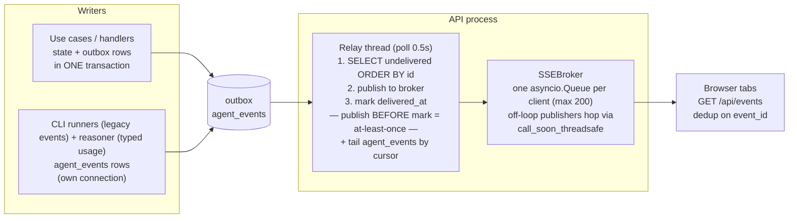

# Events & observability

*Two event streams, one operational execution ledger, and one delivery path; what an operator can see, and how secrets stay out of all of it.*

Code anchors: `backend/src/domain/events/` (domain event types), `backend/src/app/execution_records.py` (operational lifecycle), `backend/src/app/observations.py` (typed evidence), `backend/src/infra/db/execution_record_repository.py` + `observation_repository.py` (persistence), `backend/src/infra/db/outbox.py` + `agent_event_sink.py` (event writers), `backend/src/api/outbox_relay.py` (delivery), and `backend/src/api/logging/` (logs).

## The two streams

| | **outbox** (domain events) | **agent_events** (operational observations + legacy runtime events) |
|---|---|---|
| Granularity | Coarse: `PhaseAdvanced`, `TaskStarted/Completed/Requeued/FailedEvent/Abandoned`, `GoalCompleted/GoalFailedEvent`, `PlanCompleted/PlanFailed`, `PlanPaused/PlanResumed`, `ReasonerFailed`, `ReplanRequested`, `AgentFellBackToDefault` | Typed `model.usage` observations plus compatible `agent.started` / `agent.finished` / `agent.failed` legacy events (streaming tool-call observations remain a roadmap seam) |
| Written | **Inside the state transaction** (`uow.outbox.add` + `uow.plans.save` commit together) — an event exists iff its state change committed | Own short transaction, **never** inside the plan transaction. Typed observations use conflict-detecting idempotent append; the legacy sink retains best-effort `INSERT OR IGNORE` behavior |
| Payloads | Minimal — IDs + tiny metadata; consumers refetch state. `TaskRequeued`/`TaskFailedEvent` carry the `FailureKind`; `PlanPaused` carries `auto` (system vs human) | Canonical rows carry kind, source, quality, schema version, observed/recorded times, optional run/attempt correlation, and an allowlisted typed payload. Legacy rows are explicitly `source=legacy`, `quality=legacy_unknown`, `schema_version=0` |
| Delivery marker | `delivered_at` column | Cursor kept by the relay (in memory — see caveat below) |

The split is deliberate: losing telemetry must never roll back plan state, and plan state committing must never block on a telemetry write.

## The execution ledger is not a third event stream

`execution_runs` and `execution_attempts` are current operational lifecycle rows, not domain events and not best-effort telemetry. Transaction 1 creates or reuses a logical run and creates the concrete invocation attempt in the same UoW as `TaskStarted` and the task state change. A retryable failure closes the attempt as FAILED and leaves the run RETRYING; success, terminal failure, or tolerant abandonment closes both. Unexpected exceptions leave a RUNNING attempt that recovery tooling can query later.

This ledger supplies stable `run_id`/`attempt_id` correlation and a task-lifetime monotonic attempt number even though `Task.attempt` remains a resettable retry-policy counter. It has no relay or public endpoint and does not replace `agent_events`. Revision `0008_typed_observations` adds nullable correlation columns to the observation stream; plan-scoped reasoner usage is typed now, while task-runtime producers are connected in Phase 3.

## Delivery: the outbox relay → SSE

The contract, end to end:

- **Routers never publish.** Mutations only write rows; the relay is the single publisher. This is what makes "state changed but nobody was told" impossible — the row *is* the notification, durably.
- **At-least-once, dedup on `event_id`.** A crash between publish and mark re-delivers; every payload carries `event_id` and consumers (the frontend SSE bridge) drop duplicates.
- **SSE events are NAMED** (`event: <type>`), so the client registers per-type listeners; agent telemetry arrives as `agent.event`.
- **No replay for late subscribers.** A client that connects after delivery starts from "now" and refetches state over REST; a full client queue drops events with a warning (slow consumers don't stall the broker). This is a deliberate UI-feed contract, not an event-sourcing bus.

⚠ Two verified caveats live in [known-issues.md](known-issues.md): the agent-events cursor resets to 0 on API restart (full-table replay to connected clients), and no table has retention.

## Structured logging

`print()` and stdlib `logging` are banned; everything is `structlog`:

- `log = structlog.get_logger(__name__)`; event names are namespaced and action-oriented: `workspace.committed`, `worker.tick_failed`, `outbox_relay.pass_failed`, `agent_runner.resolved`.
- The API's `RequestLoggingMiddleware` binds a correlation id (`X-Request-ID`, also exposed to browsers) into a contextvar; the one error-mapping layer logs domain errors with their stable `code` and full stack traces for unhandled 500s — the client gets a generic envelope, never a trace.
- The worker logs claim/drive/release transitions and warns at boot (real mode) about missing runtime binaries (`dependency_checker.py`).

## What an operator can see today

| Question | Answer surface |
|---|---|
| What phase is every plan in? Who holds the lease? | `GET /api/plans` (promoted columns — cheap, no document parse) |
| The full state of one plan | `GET /api/plans/{id}` — the entire aggregate document |
| What's happening right now | `GET /api/events` SSE — domain events + live agent start/finish |
| Which invocations are incomplete after a crash? | Internal `ExecutionRecordRepository.list_open_attempts` (recovery seam; no public endpoint yet) |
| Is the runtime wired correctly? | `GET /api/runner/status` (mode, per-agent binding validity, binary probes) · `GET /api/reasoner/status` |
| What did the user and reasoner say? | `GET /api/plans/{id}/chat` |
| A plan's agent/reasoner telemetry history | `GET /api/plans/{id}/agent-events?task_id=&limit=` — durable, most-recent-first, optionally per task (the console/DetailPanel live tail plus reload-survivable history) |
| LLM token spend + agent run/failure counts | `GET /api/metrics?plan_id=` — sessions/calls/tokens and failures grouped by `FailureKind` (rate-limit visibility), aggregated over `agent_events` via `json_extract` |

**Reasoner usage observations:** `OpenAIChatClient` reads provider `response.usage`; `run_tool_session` sums it across turns; `OpenAIReasoner` appends one plan-scoped, provider-sourced `model.usage` observation per successful session. The physical row retains legacy `type=llm.call` so the existing relay, history endpoint, and metrics query continue working. Reported counters use quality `reported`; omitted provider usage is stored as nullable counters with quality `unavailable` and reason `provider_did_not_report_usage`, never fabricated as zero in the canonical record. Observation failure is logged and isolated from planning. Failed sessions and CLI-agent usage remain uncovered.

**Compatibility caveat:** `GET /api/metrics` is still the legacy roll-up and uses SQL `COALESCE`; it can display unavailable token usage as zero. Policy and future coverage-aware reporting must read typed observations, not this endpoint.

**Known blind spots** (scheduled in [ROADMAP.md](../../ROADMAP.md) "Next"): there is no attempt-history API; CLI runtime events still use the resettable domain attempt counter and `legacy_unknown` quality; failed sessions, CLI-agent tokens, tool calls, failed stdout beyond `reason[-500:]`, worker liveness, run→Git reporting, retention, and recovery reconciliation remain unavailable.

## Secrets hygiene

Three rules, enforced at the choke points:

1. Keys live **envelope-encrypted** in the `secrets` table; catalog rows carry only `api_key_ref` URIs.
2. `SqliteSecretStore.resolve()` is the **single decryption point**; the store is passed to factories as a thunk so stub/dry-run modes never construct it (it fails closed on a missing `ORCHESTRATOR_MASTER_KEY`).
3. Never log key material: domain-error `context` is log-safe by contract. Typed observation serialization is an allowlist and excludes prompts, completions, messages, source code, raw output, credentials, and arbitrary dictionaries.
