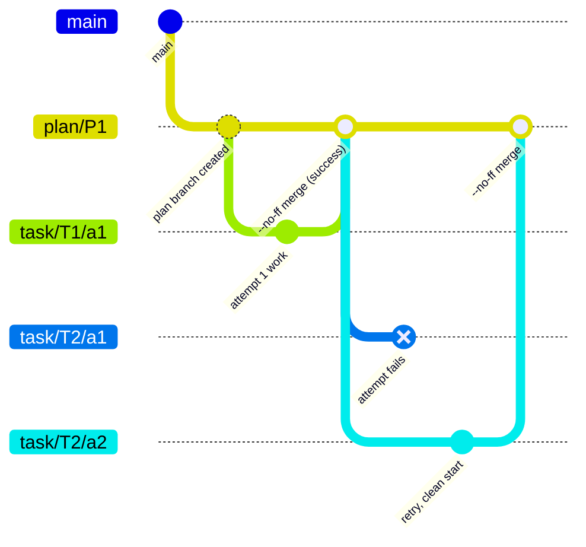

# The execution model — worker, lease, crash choreography, workspace

*How tasks actually run, and why a crash at any instruction leaves the system resumable.*

Code anchors: `backend/src/app/use_cases/run_worker.py` (the loop), `backend/src/infra/db/plan_repository.py` (the lease SQL), `backend/src/app/handlers/execution_handler.py` (the two-transaction choreography), `backend/src/domain/services/navigation.py` (the scan), `backend/src/infra/git/workspace.py` (the rollback), `backend/src/infra/runtime/` (the runners).

## The worker loop


Three hard-won behaviors are encoded here:

- **The tick reports *progress*, not *claiming*** (`worker_tick`). A claim that immediately comes back `not_ready`/`paused` with zero steps returns `False` so the caller sleeps — returning `True` there produced a verified hot claim→release CPU spin on any plan whose work was entirely backing off.
- **A tick exception never kills the worker** (`infra/worker/main.py`): log, release (the `finally` already did), sleep one poll, keep serving. ⚠ This combines badly with the claim ordering — see [known-issues.md](known-issues.md) H2 (poisoned-plan starvation).
- **Crash recovery is the lease, nothing else.** A dead worker's lease expires; any worker's next claim resumes the plan from persisted state. There is no supervisor logic, no reconciler. Lease times are integer epochs from the injected `Clock`, so tests drive expiry deterministically with `FakeClock.advance()`.

Concurrency today is **sequential per plan** by decision ([ADR-001](../decisions/adr-001-concurrency-lease.md)): the lease is plan-granular, and its granularity (plan → goal → task) is the designed future parallelism switch.

## The pull-scan — `next_action(goals, now)`

Pure function, no stored cursor. Every RUNNING step re-derives the frontier by scanning statuses:

- **`(goal, task)`** — run this task: first non-terminal, ready task (position order) in the first reachable goal.
- **`(goal, None)`** — the goal's tasks are all terminal, none failed → close it DONE.
- **`(goal, "GOAL_FAILED")`** — a FAILED task with no retries left → the goal-failure policy halts the plan.
- **`NOT_READY`** — work exists but everything runnable is gated by an unexpired `retry_not_before` → release and re-check later.
- **`None`** — nothing left → RUNNING exits into REVIEW.

Readiness conditions make nodes *skipped, not stuck*: a goal whose `depends_on` aren't all DONE, and a task whose backoff hasn't expired, are simply never selected. `now` is injected — the domain never reads a clock.

## One task's execution — the two-transaction choreography

The crash-safety core. Read it as: *state transitions are transactional; side effects are not; finalize steps re-read and re-guard.*

```mermaid
sequenceDiagram
    participant H as ExecutionHandler
    participant DB as SQLite (UoW txns)
    participant WS as GitBranchWorkspace
    participant A as AgentRunner (subprocess)

    rect rgba(120,120,240,0.12)
        note over H,DB: txn1 — pick & mark
        H->>DB: re-read plan · peek_next(now)
        note over H: check-before-act: if task already has a result<br/>(crash after agent, before finalize) → finalize WITHOUT re-running
        H->>DB: resolve AgentSpec (missing agent fails fast)<br/>start_task (RUNNING, attempt++)<br/>snapshot plain values into _Unit<br/>bump_version · outbox TaskStarted · save · COMMIT
    end

    note over H,A: — no transaction open from here —
    H->>WS: begin(plan, task, attempt) → worktree on task/&lt;id&gt;/a&lt;n&gt;
    H->>A: run(task_snapshot, spec, idempotency_key, event_sink, workspace)
    alt success
        A-->>H: TaskResult
        H->>WS: commit → --no-ff merge into plan/&lt;id&gt;
        rect rgba(120,240,120,0.12)
            note over H,DB: txn2 — finalize success
            H->>DB: re-read · tolerant-finalize check<br/>complete_task · bump · outbox TaskCompleted · COMMIT
        end
    else TaskFailed(reason, kind)
        A-->>H: raises
        H->>WS: discard → worktree + branch deleted (zero trace)
        rect rgba(240,120,120,0.12)
            note over H,DB: txn2 — finalize failure
            H->>DB: re-read · tolerant-finalize check<br/>should_retry(attempt, kind)?<br/>yes → requeue(retry_not_before = now + backoff)<br/>no → fail_task → GOAL_FAILED next scan
        end
    end
```

The rules that make this safe, each the answer to a specific crash:

1. **Check-before-act idempotency** — a crash *after* the agent returned but *before* txn2 leaves a RUNNING task with a persisted result; the next pick finalizes it without re-invoking the agent. (⚠ The window between the *git merge* and txn2 is not covered — known-issue #2.)
2. **No live aggregate refs cross a transaction boundary** — txn1 snapshots plain values into the frozen `_Unit` dataclass; finalize transactions re-read fresh state. This is what detached-aggregate semantics on real SQLite demand.
3. **Tolerant finalize** — if the plan left RUNNING mid-flight (a replan), a late failure **terminal-skips** (never requeues into the abandoned iteration) and a late success lands as harmless history unless the finalize-abandon already closed the task.
4. **The backoff gate is durable** — `retry_not_before` is a persisted timestamp the scan honors, not an in-memory sleep. It survives crashes and never blocks other ready work.

## Retries — the shared failure taxonomy

`FailureKind` is produced by **both** the real CLI runners (`infra/runtime/taxonomy.py`, conservative pattern-matching over process output — anything unrecognized is retryable `TOOL_ERROR`, because misclassifying transient-as-terminal kills a plan while the reverse merely wastes a retry) **and** the scriptable dry-run dummy — so dry-run tests exercise exactly the production retry/terminal paths.

| Kind | Classified from | Retry? |
|---|---|---|
| `connection_error` | network/DNS/socket patterns | ✅ with backoff |
| `rate_limit` | 429 / "rate limit" / "overloaded" | ✅ |
| `timeout` | subprocess `TimeoutExpired` | ✅ |
| `tool_error` | anything unrecognized, nonzero exit | ✅ |
| `token_limit` | context/max-tokens patterns | ❌ terminal — identical on every retry |
| `auth_error` | 401/403/invalid-key patterns — **also** raised for broken agent bindings | ❌ terminal — config never fixes itself mid-retry-loop |

`RetryPolicy` (persisted per plan): `max_attempts=3`, exponential backoff 2s·2ⁿ capped at 60s. The *decision* is domain; the *wait* is the scan skipping the task until the gate expires.

## Agent runners — catalog-resolved, per run

`agent_runner.mode` (SQLite config) selects globally:

- **`dry-run`** (default) — the scriptable `DummyAgentRunner` **is** the dry-run runtime; never touches the secret store.
- **`real`** — `CatalogAgentRunner` resolves **per task, per run** from the bound `AgentSpec`: `runtime_type` picks the CLI (`pi` → `pi --model … -p`, `claude` → `claude --dangerously-skip-permissions -p`, `gemini` → `gemini --yolo -p`), the provider row supplies the envelope-encrypted key (pi's backend env var derives from the provider id/name), the model row the model string. A broken binding raises terminal `TaskFailed(AUTH_ERROR)`; write-time referential checks return `AGENT_RUNNER_CONFIG_INVALID` → 422; `GET /api/runner/status` reports bindings and binary probes. Resolution per run means agent edits and key rotations apply without restarts — nothing caches a built runner.

Subprocesses are blocking, hopped off the event loop via `asyncio.to_thread`; runners know **nothing** about retries or ordering — they are a pure "execute this task now" hand. The task prompt is a markdown contract (`build_task_prompt`); project conventions belong in the workspace's `AGENTS.md`, not in the runner.

## The workspace — git branching as the rollback mechanism



- `begin` → branch `task/<task_id>/a<attempt>` off `plan/<plan_id>` (created off the default branch on first use) + a temp worktree. `branch -f` makes begin idempotent against a crashed prior run of the same attempt.
- `commit` → commit the worktree, `--no-ff` merge into the plan branch via a throwaway merge worktree, clean up. The merge preserves the attempt in history.
- `discard` → remove worktree + delete branch. **The rollback**: a failed attempt leaves zero trace; the retry begins clean from the plan branch — stateless task execution.

`main` is never touched by plan work. GitHub PR output is deferred behind the Workspace port (see [legacy doc](../legacy/pre-refactor-backend.md)). ⚠ Orphan-debris caveats (no `worktree prune`, plan branches never GC'd) are in [known-issues.md](known-issues.md).
