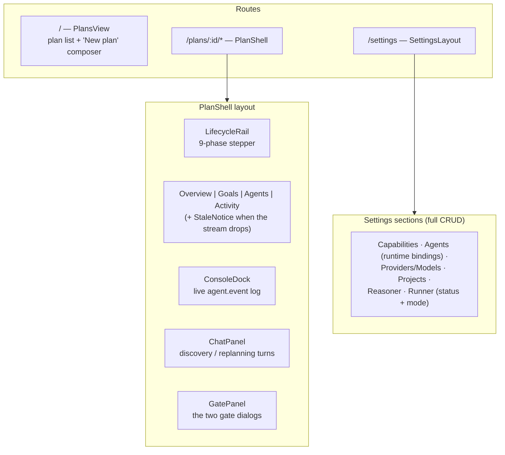
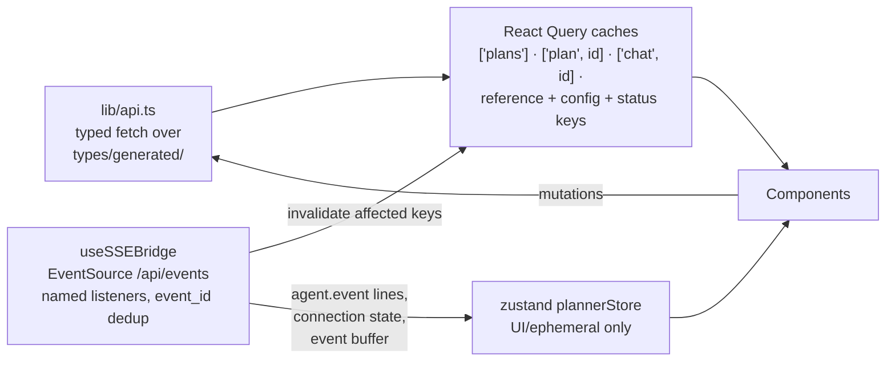

# The frontend — React dashboard

*A thin, live view over the API: React Query owns server state, one SSE bridge keeps it fresh, zustand holds only UI/ephemeral state.*

Code anchors: `frontend/src/App.tsx` (routes + shell), `lib/api.ts` (fetch layer), `lib/queries.ts` (React Query hooks + the SSE bridge), `store/plannerStore.ts` (zustand), `types/generated/` (OpenAPI-generated) + `types/ui.ts` (the hand-declared plan detail model).

Stack: React 18 · Vite · TypeScript strict (no `any`) · @tanstack/react-query v5 · zustand · react-router v6 · @xyflow/react + dagre (the goals canvas) · CSS modules with a theme system (IBM Plex).

## Screens and shell

- **GoalsView** renders the goal/task tree as a two-level dagre-laid-out flow graph (`lib/layout.ts`): goal group nodes containing task nodes with status badges.
- **GatePanel** is where the human gates live: AWAITING_REVIEW → an inline **RoadmapEditor** (rename/add/remove goals & tasks via `POST /edits` — the first real call sites of `useApplyEdit`), then approve, or "request changes" (`POST /review/reopen` → reopens the chat, next commit replaces the roadmap); REVIEW → finish or replan.
- **LifecycleRail** carries the pause controls: a **Pause** button in the worker-driven phases, an amber **paused card** (any phase) with **Resume** (= the manual retry), and a red dead-end card for terminal `failed`. `PlanPaused`/`PlanResumed` SSE events toast and invalidate.
- **DetailPanel** is editable at the gate or while paused (rename/description via `update_task`, delete via `remove_task`, agent rebind via `rebind_task_agent`, mirroring the backend guards) and shows a durable per-task **Agent log** from `GET /plans/{id}/agent-events`.
- **ConsoleDock** colors the live feed by severity (`agent.failed` red, `agent.finished` green, `llm.call` purple) and can filter to the selected task; plan-scoped `llm.call` rows show a `plan` badge.
- **Activity** carries a **metrics strip** (`GET /api/metrics`, polled): LLM sessions/calls/tokens and agent run/failure counts, with rate-limited failures highlighted.
- **ChatPanel** is enabled only in the conversational phases; a send POSTs the message and appends the reply from the HTTP body (`MessageResponse{reply, committed, phase}`) — it does not wait on SSE. History hydrates from `GET /plans/{id}/chat`.

## Data flow — one source of truth per kind of state

The division of labor that keeps this simple:

- **Server state lives in React Query.** SSE events don't carry state — they *invalidate* the affected query keys (`PhaseAdvanced`, `Task*`, `Goal*`, `Plan*` events → refetch that plan; reference/config mutations → refetch catalogs + status). Payloads stay minimal by backend contract, so the UI always re-reads truth instead of patching caches.
- **zustand holds what the server doesn't own**: the SSE connection state, a bounded buffered-event feed (Activity), agent console lines (ConsoleDock), and toasts.
- **Degradation is explicit**: when the stream drops, the main view dims behind a `StaleNotice` ("showing data as of …") and reconnection triggers a blanket `invalidateQueries()` — the refetch-on-reconnect strategy that makes SSE replay unnecessary.

## Type generation

`npm run generate:api` exports the backend's OpenAPI schema (`backend/scripts/export_openapi.py`) and runs `openapi-ts` into `src/types/generated/`. Operation IDs are stable (`plans-create`) via the backend's `generate_unique_id_function`. One exception is hand-maintained: the **plan detail read model** (the full aggregate document returned by `GET /plans/{id}`) is declared in `src/types/ui.ts` — keep it in sync with the domain when the aggregate changes.

## Conventions

- Strictly typed; no `any`. DTOs come from `types/generated/` — never hand-redefine them.
- Mutations follow one shape (`lib/queries.ts`): invalidate the affected keys on success, toast the error envelope's `message` on failure.
- Reusable primitives live in `components/ui/` (Button, Card, Dialog, Field, Input, Select, ConfirmAction — destructive actions are two-step).
- Dev: `npm run dev` (Vite, port 5173 — already in the API's default CORS list). Build: `npm run build` (tsc + vite).
