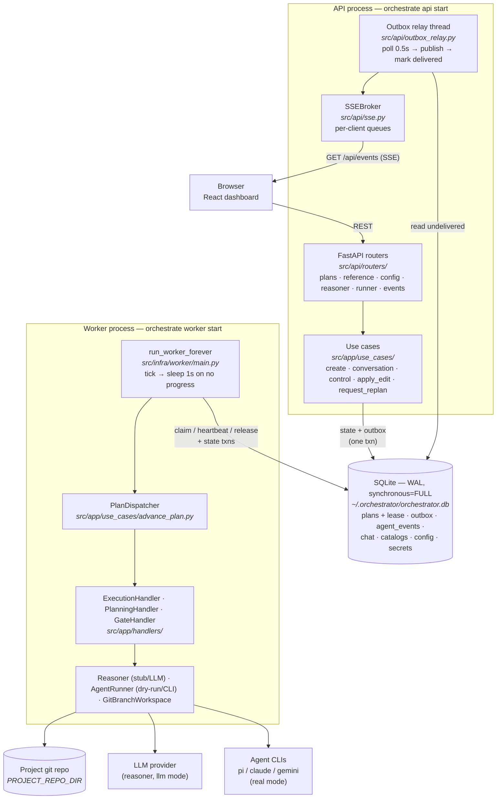
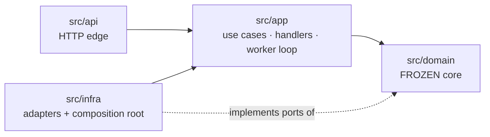

# Architecture overview

*What runs, where every concern lives, and the one dependency rule that keeps it honest.*

## The system in one paragraph

Two long-running processes share one SQLite file. The **API process** hosts thin FastAPI routers (each mapping 1:1 onto an application use case), an SSE broker, and a background **outbox relay** thread that turns committed database rows into live events. The **worker process** runs a claim-and-drive loop: it leases a plan that needs autonomous work, advances it one unit at a time through phase handlers, and releases it when the plan pauses at a human gate, backs off, or finishes. All coordination between the two processes happens **through the database** — a per-plan lease for ownership, a version CAS for write safety, and a transactional outbox for events. There is no message broker, no in-process coordinator threads, and no reconciler: what isn't ready is simply never selected.

## Process topology

Why this shape:

- **The DB is the only rendezvous.** A dead worker needs no supervisor cleanup — its lease expires and any other worker's next claim resumes the plan from persisted state. The pre-refactor system's task-manager/reconciler/goal-orchestrator threads are all gone; their jobs are absorbed by the lease + the pull-scan (see [decision log](../decisions/decision-log.md)).
- **Routers never publish events.** Mutations write outbox rows inside the state transaction; only the relay talks to the broker. This is what makes event delivery *transactional with state* — an event exists iff its state change committed.
- **Side effects live outside transactions.** LLM calls and agent subprocesses run with no transaction open; finalize steps re-read and re-guard. No transaction ever spans a network call.

## The hexagonal layers

**The dependency rule** (enforced by review, tested by import discipline):

1. `domain` imports nothing from `app`, `infra`, or `api`. It is plain Python + Pydantic — no clock, no I/O, no framework. `now` is always injected.
2. `app` depends only on `domain` and on **ports** (Protocols). The in-memory fakes it tests against live in `src/app/testing/fakes.py`; infra re-exports what it shares (e.g. the dummy runner is *the* dry-run runtime).
3. `infra` implements the ports (SQLite, git, subprocesses, LLM clients) and owns the **composition root** — `src/infra/container.py` is the *only* place the environment is read.
4. `api` is a delivery mechanism: routers call use cases and let typed errors bubble to one code→HTTP table (`src/api/exceptions.py::_STATUS_BY_CODE`).

### Where each concern lives

| Concern | Home | The load-bearing idea |
|---|---|---|
| Plan/goal/task state machine | `domain/aggregates/planner_orchestrator.py` | The aggregate is the **only** caller of entity transitions; illegal moves raise `InvalidTransitionError` |
| "What runs next" | `domain/services/navigation.py` | **Derived, never stored** — re-scan every tick; no cursor to desync |
| Retry/terminal decision | `domain/policies/retry_policies.py` + `FailureKind` | The domain decides *whether/how long*; it never sleeps — backoff is a persisted timestamp the scan honors |
| Transaction boundaries | `app/use_cases/*`, `app/handlers/*` | `bump_version()` then `save()` (CAS); outbox rows in the same txn |
| Phase routing | `app/use_cases/advance_plan.py` | Thin dispatcher: RUNNING→Execution, planning phases→Planning, gates→Gate, terminal→signal |
| Persistence | `infra/db/` | Plan = one JSON document; promoted columns only for what SQL must predicate on |
| Runtime resolution | `infra/runtime/factory.py`, `infra/reasoner/factory.py` | Catalog-driven, per-run; dry-run/stub **never** construct the secret store |
| Event delivery | `api/outbox_relay.py` + `api/sse.py` | At-least-once, publish-then-mark, consumers dedup on `event_id` |

## The domain freeze

The domain layer is **frozen** (Phase-0, 2026-07-02): its contracts change only with a deliberate, recorded un-freeze. One has happened so far — `AgentSpec.runtime_type/provider_id/model_id` (2026-07-05, the agent registry taking ownership of runtime resolution). The freeze is why the rest of the system could be rebuilt around the core with confidence; treat un-freezes as events worth a decision-log entry, not casual edits.

## Configuration model

Two tiers, deliberately split:

- **Environment** (read only in the container): *where things are* — `ORCHESTRATOR_HOME`, `PROJECT_REPO_DIR`, `ORCHESTRATOR_MASTER_KEY`, `ORCHESTRATOR_API_TOKEN`. Nothing behavioral.
- **SQLite `config` table** (two-tier: scope `orchestrator` | project id): *how things behave* — `reasoner.mode`, `agent_runner.mode`, timeouts, provider/model bindings. Editable at runtime via CLI/API; resolution happens **per run**, so key rotation and agent edits apply without restarts.

The old `AGENT_MODE` environment variable is gone on purpose — runtime selection is data, not deployment configuration.

## Reading the code

Every layer and most domain sub-packages carry a `README.md` beside the code (`backend/src/domain/README.md`, `backend/src/app/README.md`, `backend/src/infra/README.md`, `backend/src/api/README.md`). Module docstrings are written as design notes — the *why* usually sits at the top of the file it explains. The frozen per-port contracts (exact SQL, signatures, API map) are in [`backend/docs/INTEGRATION_GUIDE.md`](../../backend/docs/INTEGRATION_GUIDE.md).
