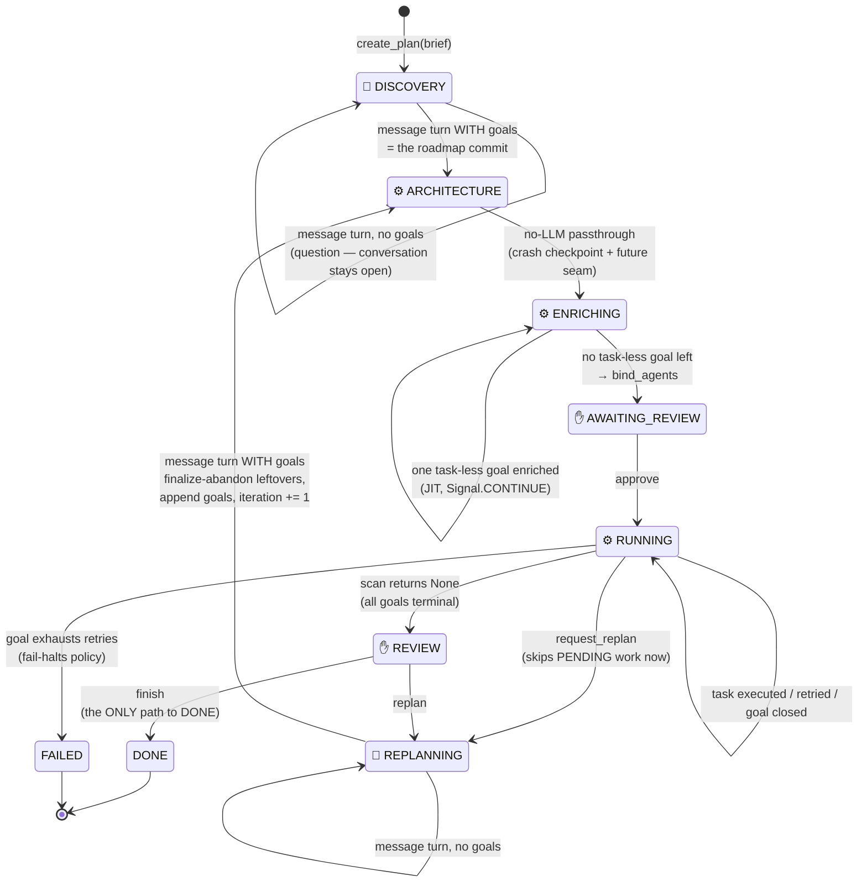
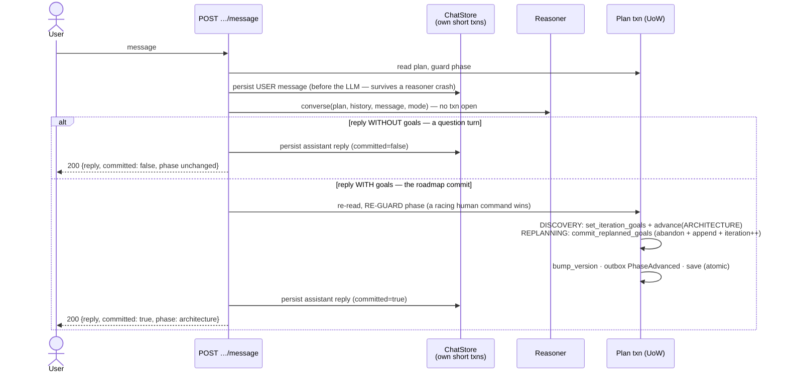

# The plan lifecycle — the nine-phase machine

*The product's heart: how a brief becomes executed work, who advances what, and how the replan loop keeps history.*

Code anchors: the machine lives in `backend/src/domain/aggregates/planner_orchestrator.py` (`PlanPhase`, the guarded transitions); the drivers are `backend/src/app/use_cases/conversation.py` (chat), `backend/src/app/handlers/planning_handler.py` + `execution_handler.py` (worker), and `backend/src/app/use_cases/control.py` (gates).

## The full state machine

Legend: 💬 chat-driven · ⚙️ worker-driven (claimable) · ✋ human gate command.

## The driver model — who advances each phase

The single most important structural idea after the phases themselves. Each phase has exactly one driver, and the worker's claim predicate (`WORKER_CLAIMABLE_PHASES` in the aggregate; the SQL in `infra/db/plan_repository.py`) makes non-worker phases **invisible to workers** — a plan waiting on chat or a human can never cause claim/release churn, because it is never claimed.

| Phase | Driver | Mechanism |
|---|---|---|
| DISCOVERY, REPLANNING | 💬 each user message | `conversation.discovery_message` / `replanning_message` — one reasoner turn per message |
| ARCHITECTURE, ENRICHING | ⚙️ worker | `PlanningHandler` — passthrough / JIT enrichment |
| RUNNING | ⚙️ worker | `ExecutionHandler` — the pull-scan (see [execution-model.md](execution-model.md)) |
| AWAITING_REVIEW, REVIEW | ✋ gate commands | `control.resume_from_review` / `finish_review` / `review_replan` — gates **always** pause; `GateHandler` returns `PAUSED` unconditionally |
| DONE, FAILED | terminal | — |

## The conversational phases (multi-turn with commit)

`_conversation_turn` in `conversation.py` is the same choreography for both DISCOVERY and REPLANNING:

Design points worth internalizing:

- **Chat is display history; the plan transaction is truth.** They run on separate transactions on purpose — a lost reply never loses plan state, a rolled-back commit never erases what the user said.
- **The chat reply travels in the HTTP response body.** SSE carries only domain events — there is no dual-publish of conversational content.
- The **stub reasoner** makes this deterministic for dry-run and tests: `ask: …` → question turn; the `goal:/task: [caps: …]` grammar → commit (goals may be committed task-less — the JIT fills them).

## ARCHITECTURE — the deliberate passthrough

`PlanningHandler._architect` advances ARCHITECTURE → ENRICHING **without calling any LLM**. This is a decision, not a gap: the old system needed an autonomous structuring run because its discovery produced only a prose brief; here the conversation commits the user-agreed goal roadmap itself, so an autonomous re-structuring pass would be redundant — and risks mangling a goal set the user just signed off. The phase stays in the frozen enum because REPLANNING re-enters through it (a free crash checkpoint between the commit and enrichment), and the handler method is the seam if a real structuring pass ever returns.

## ENRICHING — just-in-time task population

One task-less goal per worker step: `reasoner.enrich_goal(plan, goal, capabilities)` (outside any txn) → re-read, re-guard, re-find the goal by id → commit its 1..N plain tasks → `Signal.CONTINUE`. The idempotency guard — *a goal that already has tasks is never re-enriched* — absorbs both crashes between the LLM call and the commit, and racing workers. Goals the user populated in chat are skipped entirely. When no task-less goal remains, `bind_agents` matches each task's `required_capabilities` against the agent registry (falling back to the default agent, with an `AgentFellBackToDefault` event) and the plan pauses at AWAITING_REVIEW.

## The replan loop — append-only, two entry points, one phase

REPLANNING is reached from REVIEW ("replan next phase") and from mid-RUNNING chat (`request_replan`). Either way:

1. **At request time** (`Plan.begin_replanning`): every PENDING goal/task is SKIPPED immediately; a RUNNING goal is left open only for its in-flight task.
2. **In-flight results land tolerantly** (`ExecutionHandler`'s finalize): a late *failure* terminal-skips — it must never requeue into an abandoned iteration (the "resurrection bug" the guards exist to prevent); a late *success* completes as harmless history.
3. **At commit time** (`Plan.commit_replanned_goals`): finalize-abandon closes whatever is still non-terminal, the new goals are **appended after** all history, and `iteration` increments — the one defined point where it does.

Prior DONE goals are never touched. They are simultaneously the audit history and the context the reasoner sees when negotiating the next iteration (their `TaskResult` outputs are rendered into the replanning prompt).

## `apply_edit` ≠ `request_replan`

Two distinct user capabilities, deliberately not conflated:

| | `apply_edit` (surgical) | `request_replan` (holistic) |
|---|---|---|
| What | add/remove/reorder tasks, edit requirements, rebind agent | "give me a different plan" — a phase transition |
| Guarded by | task/goal status + capability-id validation; requirements-edit re-runs `match_agent`; explicit `RebindTaskAgent` = override | the aggregate's phase guard |
| Where | `app/use_cases/apply_edit.py` + `domain/services/edit_service.py` | `app/use_cases/request_replan.py` |

## Invariants to defend in review

- DONE is reached **only** via REVIEW "finish" (`finish_review` emits `PlanCompleted`). Execution exhausting its scan goes to REVIEW, never DONE.
- Goal/task fields are mutated **only** through the aggregate's guarded methods — never from use cases.
- Every phase-advancing write: `bump_version()` → outbox event → `save()`, all in one transaction.
- A failed goal halts the plan (`fail_goal` sets FAILED) — skip-and-continue is a future knob, not current behavior.
- `iteration` increments in exactly one place: `commit_replanned_goals`.
