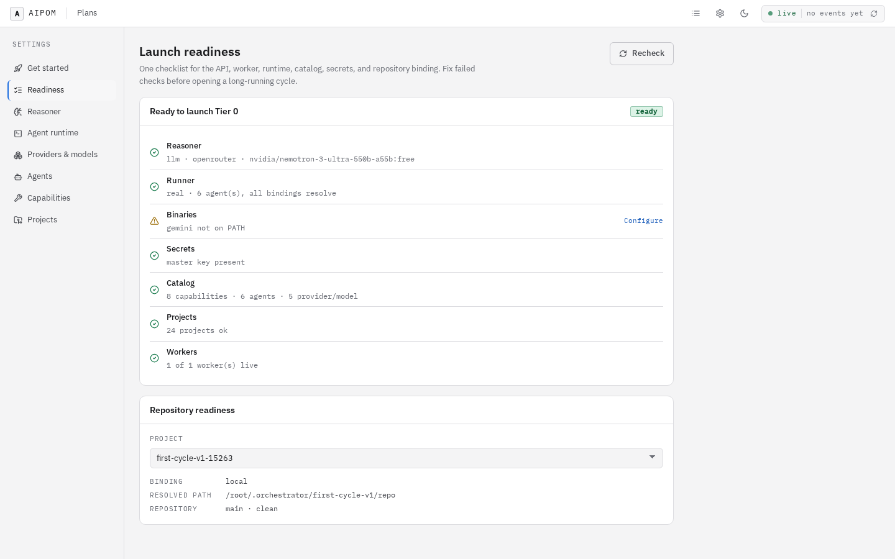
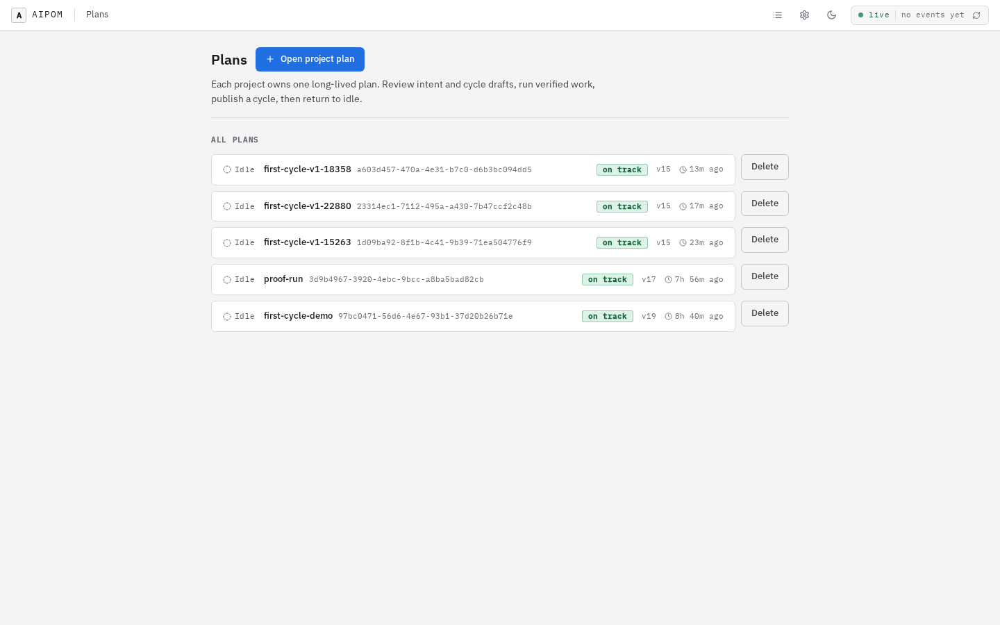
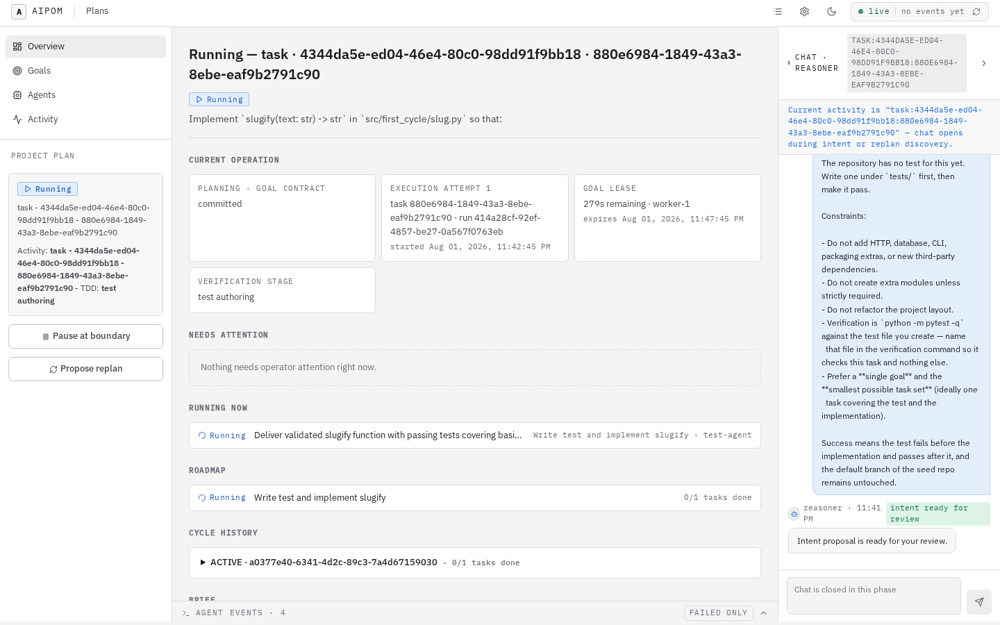
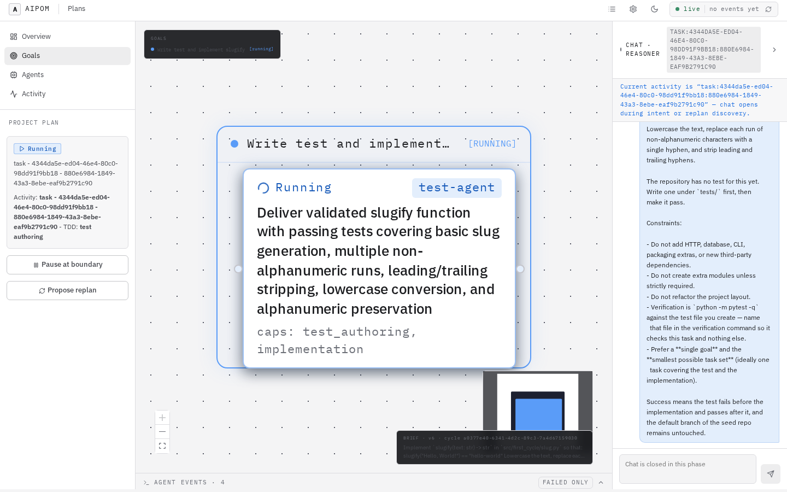
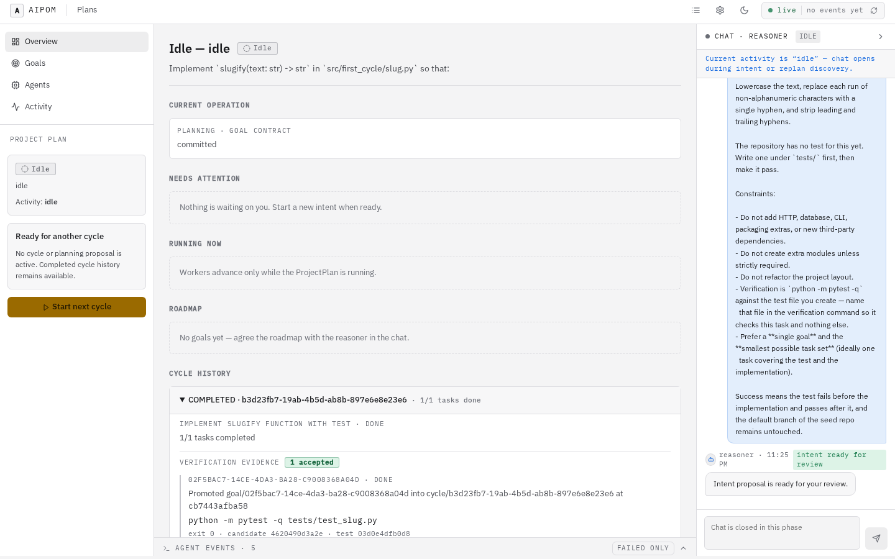

# Getting started

From nothing to a completed cycle. Tier 0 — free, deterministic, no API key.

You need **Python 3.11+** and **Git**. Nothing else.

## The five-minute demo

If you would rather see it work before reading how it works, this is the whole
thing, against a throwaway state directory and a disposable repository the
fixture creates for you:

```bash
git clone https://github.com/guilhermeUpToTask/agent-orchestrator-prototype
cd agent-orchestrator-prototype

pipx install praxis-orchestrator
praxis config set reasoner.mode stub        # Tier 0: no API key, no network
praxis config set agent_runner.mode dry-run
praxis serve &                              # migrate + API + worker + console

./fixtures/first-cycle-v1/scripts/preflight.sh   # what must be true before a run
./fixtures/first-cycle-v1/scripts/materialize.sh # the disposable target repo
./fixtures/first-cycle-v1/scripts/run-cycle.sh   # project → gates → execution → publication
```

`run-cycle.sh` prints the plan id and finishes by showing the accepted evidence.
Check it rather than trusting it — `verify_run.py` re-derives the result from
served facts and from git:

```bash
python3 fixtures/first-cycle-v1/scripts/verify_run.py \
  --plan "$PLAN_ID" --repo ~/.praxis/first-cycle-v1/repo --tier 0
```

Ten checks, including the one that matters most: your default branch is
byte-identical to where it started. Then open <http://127.0.0.1:8000> and look
at the plan the terminal just drove — the console is a second client of the same
API, not a separate story.

## 1. Install and start

```bash
pipx install praxis-orchestrator     # or: uvx --from praxis-orchestrator orchestrate
praxis serve
```

```
✓  state directory /home/you/.orchestrator
✓  worker worker-1 started (pid 12345)
✓  http://127.0.0.1:8000
```

One command does four things: migrates the state directory, starts the API,
supervises a worker as its own process, and serves the console — the wheel
carries the built UI, so there is no second install and no second port.

State lives in `PRAXIS_HOME` (default `~/.praxis`): your plans,
evidence and encrypted keys. Point it elsewhere with the environment variable if
you want a throwaway install:

```bash
PRAXIS_HOME=/tmp/try-orchestrator praxis serve --port 8100
```

## 2. Set it up

Open <http://127.0.0.1:8000> and go to **Settings → Get started**.

The wizard sequences setup in the order the pieces depend on each other, and
shows progress as `n / total`. Leave the tier on **Tier 0 — free, no API key**
and it opens at 2/5, because stub planning and the dry-run runtime are already
the defaults. Three things remain:

1. **Create an agent** — tasks bind to an agent; dry-run needs no provider.
2. **Set the default agent** — the fallback for any task no capability covers.
3. **Create a project** — name it, and give it the **path to a Git repository
   you can afford to lose**. Leave the path blank and you get a scratch repo
   instead, which is fine for a first look but means the run touches nothing of
   yours.

Every step is also reachable from its own settings section; the wizard just
orders them and does the minimum write for each.

**Settings → Launch readiness** is the same truth as a checklist, and it is the
first place to look when something will not start:



## 3. Run a cycle

From the **Plans** screen, *Open project plan*, pick your project, and describe
what you want built. Keep the first one small — one goal, one or two tasks.



One project owns one long-lived plan, so re-opening a project returns the plan
you already have and starts its next cycle on it. `Idle` means "no cycle in
flight, ready for the next one" — it is not finished, because the root plan is
never terminal.

What happens next, and where you appear in it:

| Stage | Who acts |
|---|---|
| **Intent** | You converse. The reasoner normalizes the brief into a proposal. |
| **Intent gate** | **You approve** the exact revision. |
| **Architecture** | The reasoner drafts an ordered goal roadmap. |
| **Draft gate** | **You approve** — approval activates the cycle. |
| **Enrichment** | Just-in-time, head goal only: a frozen contract with criteria, scope, commands and one verification mode. |
| **Execution** | The worker runs each task; output is verified before anything is promoted. |
| **Publication gate** | **You choose** the disposition. |

On Tier 0 the reasoner follows a deterministic grammar rather than a model, so
discovery may ask a clarifying question before it commits. Answer it and it
proceeds.

Watch progress on **Overview**: current operation, worker lease, attempts, and
two separate queues — **Needs attention** (you) versus **Recovering
automatically** (not you).



Read that top row left to right: the planning operation committed, execution
attempt 1 is running with its run id, the goal lease has 279 seconds left and is
held by `worker-1`, and the verification stage is *test authoring* — the agent is
writing the failing test, not the implementation. The lease is the answer to
"is this working or wedged": a live attempt renews it, a dead worker's does not.

**Goals** draws the same run as the roadmap the reasoner drafted, with the agent
each task is bound to and the capabilities it was chosen for:



## 4. Find the result

Your default branch is untouched — that is a guarantee, not a coincidence. Work
lands on `cycle/<cycle_id>`, promoted from `goal/<goal_id>`, promoted from
`task/<task_id>/<run_id>`, and only independently verified work moves up a level.

```bash
git -C /path/to/your/repo branch -a
git -C /path/to/your/repo log --oneline cycle/<cycle_id>
```

At the publication gate you record a disposition: `retain_branch` (keep the
branch and open a PR yourself), `merge`, `open_pr`, or `discard`. The
orchestrator has **no authenticated forge integration** — `merge` and `open_pr`
record a reference to an operation *you* performed. It never pushes or merges on
your behalf.

The evidence behind the run — the exact command, its exit code, the candidate
and test commits, the promotion SHAs — is on the cycle. Expand the completed
cycle under **Cycle history**:



That is the whole claim in one place: `python -m pytest -q tests/test_slug.py`
exited 0 against candidate `4620490d`, and `goal/02f5bac7…` merged into
`cycle/b3d23fb7…` at `cb7443af`. The same facts are one API read away —
see [evidence.md](evidence.md).

## Prefer the terminal?

`fixtures/first-cycle-v1/` is the same walkthrough over the API only, in one
command, with a checker that verifies the result rather than trusting it:

```bash
./fixtures/first-cycle-v1/scripts/materialize.sh    # a disposable target repo
./fixtures/first-cycle-v1/scripts/run-cycle.sh      # the whole cycle
python3 fixtures/first-cycle-v1/scripts/verify_run.py --plan "$PLAN" --repo "$REPO"
```

## Next

- [tier-1.md](tier-1.md) — real models writing real code, and what it costs
- [troubleshooting.md](troubleshooting.md) — real failures and their fixes
- [../../SECURITY.md](../../SECURITY.md) — **read before pointing it at anything
  you care about**: agent runtimes are unsandboxed
