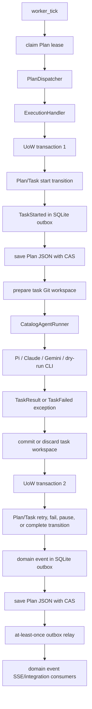
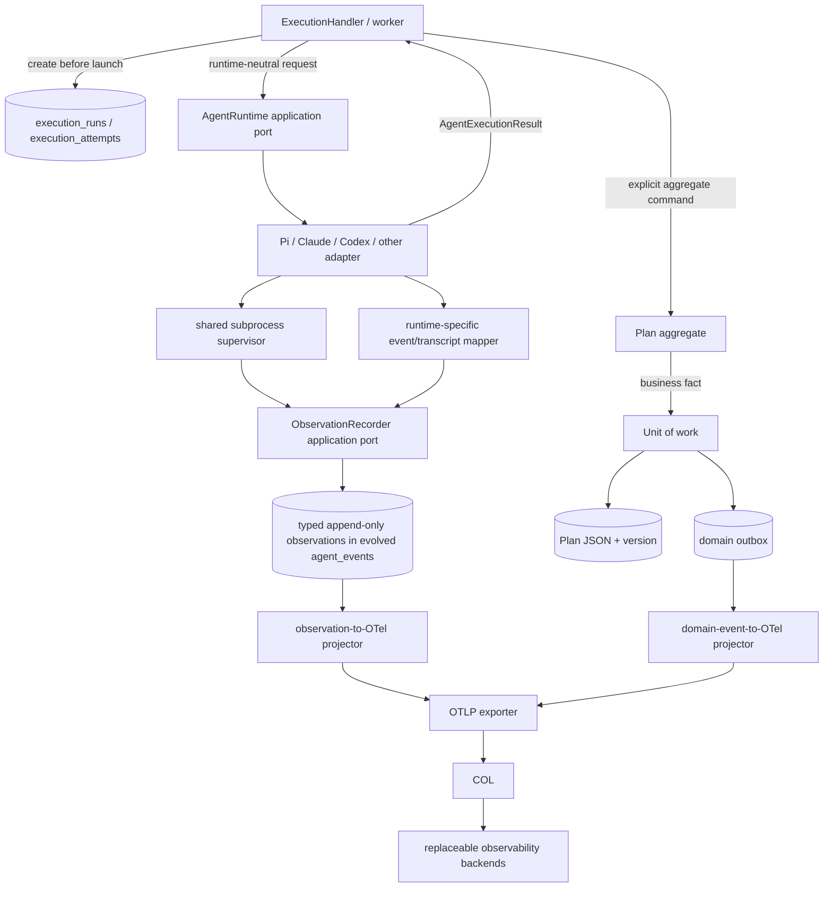

# Runtime-neutral telemetry architecture analysis

Date: 2026-07-13
Scope: current repository state and an incremental implementation plan
Status: analysis only; no production implementation is included

## 1. Executive summary

The repository already has the right architectural backbone for runtime-neutral observability: a `Plan` aggregate that owns workflow transitions, an application handler that executes runtime work outside aggregate transactions, a transactional domain-event outbox, infrastructure-local CLI integrations, and a separate SQLite `agent_events` stream. The safest design is therefore an evolution of those seams, not a second event architecture or a rewrite.

The largest problems are semantic rather than structural:

- `AgentEvent` and `AgentEventSink` live under `domain/` even though they carry operational observations such as `agent.step` and `llm.call`.
- execution identity is only `(plan_id, task_id, attempt: int)`. `Task.retry()` resets the attempt counter, so it is not a stable lifetime identity.
- runtime outcomes are split between `TaskResult` and the application exception `TaskFailed`; neither contract represents cancellation, partial output, artifacts, and unavailable usage consistently.
- the CLI runner observes only process completion, not streaming, cancellation, process descendants, native runtime events, sessions, model requests, or transcripts.
- usage events replace absent counters with zero, and the metrics reader also coalesces missing values to zero. That makes coverage indistinguishable from real zero usage.
- operational records have random IDs, free-form string payloads, and no provenance, quality, schema version, or deterministic idempotency key.
- domain outbox persistence is crash-safe and atomic with aggregate changes; telemetry persistence is deliberately best-effort and independent, but can silently lose observations and cannot identify incomplete runs.

The recommended foundation is:

1. Add a runtime-neutral execution ledger with a logical `run_id` and a unique `attempt_id` minted before a runtime starts.
2. Move the runtime execution and observation contracts to the application boundary while preserving compatibility imports.
3. Evolve the existing `agent_events` table into a typed, append-only observation ledger instead of creating a competing telemetry stream.
4. Instrument a shared subprocess supervisor and keep Pi, Claude Code, Codex, and transcript/JSONL mapping in runtime-specific infrastructure.
5. Project canonical observations and domain facts to OpenTelemetry asynchronously through an OpenTelemetry Collector.

The first implementation slice should only add execution-run and attempt identity, persistence, and correlation propagation. It should preserve all current workflow behavior and avoid OpenTelemetry, OpenRouter, and runtime parsing until the identities are reliable.

## 2. Repository findings

### Domain model

- [`Plan`](../../../backend/src/domain/aggregates/planner_orchestrator.py) is the aggregate root. `PlanPhase` defines nine lifecycle phases, while `Plan.pause()`, `Plan.resume()`, task-start, task-result, and goal-completion methods enforce transitions. The aggregate stores planning backoff and pause state, but no provider, trace, token, cost, or telemetry state.
- [`Task`](../../../backend/src/domain/entities/task.py) stores `status`, `result`, integer `attempt`, `reopen_count`, and retry timing. `Task.start()` increments `attempt`; `Task.retry()` resets it to zero. That counter is a retry-policy value, not a durable execution-attempt identity.
- [`Goal`](../../../backend/src/domain/entities/goal.py) owns goal state and tasks. There is no runtime execution aggregate.
- [`ProjectDefinition`](../../../backend/src/domain/entities/project_definition.py) is catalog/configuration data and is not the owner of a `Plan`. Consequently, persisted plans and events have no `project_id` correlation today.
- [`FailureKind`](../../../backend/src/domain/value_objects/lifecycle.py) contains business-facing failure categories: connection, rate limit, token limit, authentication, timeout, and tool failure.
- [`TaskResult`](../../../backend/src/domain/value_objects/tasks_vos.py) carries success/failure, output, artifacts, failure data, and arbitrary metadata. It currently doubles as the runner return type and persisted task result.
- [`AgentSpec`](../../../backend/src/domain/entities/agent_spec.py) contains `runtime_type`, `provider_id`, and `model_id`, with a `"pi"` default and vendor examples. Runtime choice is a legitimate task configuration concern, but concrete defaults and the fixed runtime vocabulary leak infrastructure registration details into the domain.

### Domain events

- [`DomainEvent`](../../../backend/src/domain/events/base.py) assigns a UUID and `datetime.now(timezone.utc)` directly. It has `plan_id` and a class-name event type, but no aggregate version, source sequence, causation ID, or correlation ID.
- [`outbox.py`](../../../backend/src/domain/events/outbox.py) defines workflow facts including `TaskStarted`, `TaskCompleted`, `TaskRequeued`, `TaskFailedEvent`, `TaskAbandoned`, `GoalCompleted`, `PlanPaused`, and `PlanResumed`.
- Aggregates do not collect events internally. Application handlers invoke aggregate methods and construct the corresponding domain events. This is an established repository convention and need not be rewritten for telemetry.
- [`AgentEvent`](../../../backend/src/domain/events/agent_events.py) is materially different: it is a generic operational record with `task_id`, integer attempt, sequence, string `type`, and `dict[str, str]` payload. Its placement in `domain/events` makes operational evidence look authoritative even though its sink is explicitly best-effort.

### Application layer and transactions

- [`ExecutionHandler`](../../../backend/src/app/handlers/execution_handler.py) uses the correct high-level transaction split:
  1. re-read and start a task inside a unit of work;
  2. save the aggregate and `TaskStarted` to the outbox;
  3. prepare a Git workspace and invoke the runtime outside the transaction;
  4. re-open a unit of work, translate result/failure into aggregate transitions, save, and enqueue resulting domain events.
- The current idempotency key is `plan_id:goal_id:task_id`, so distinct attempts are not distinguishable by the runner contract.
- Raw Pi, Claude, Gemini, or OpenRouter structures are not interpreted by `ExecutionHandler`; that separation should be retained.
- [`worker_tick`](../../../backend/src/app/use_cases/run_worker.py) claims a plan lease, drives work, heartbeats after completed units, and releases in `finally`. It does not heartbeat while a long runtime process is executing.
- [`app/ports.py`](../../../backend/src/app/ports.py) defines `UnitOfWork`, the application exceptions, and re-exports several domain ports. Commands, worker messages, and application events do not have a common durable bus; `Signal` is an in-process worker control result.

### Runtime integrations

- [`CliAgentRunner`](../../../backend/src/infra/runtime/cli_runner.py) supervises a one-shot process through blocking `subprocess.run()` in `asyncio.to_thread()`. It captures stdout/stderr, handles timeout and missing binaries, and applies regex-based failure classification.
- It emits only `agent.started` and `agent.finished`/`agent.failed`, with sequence 0/1. It has no streaming parser, explicit cancellation contract, process-group cleanup, resource measurements, runtime session identity, or partial transcript recovery.
- [`CatalogAgentRunner`](../../../backend/src/infra/runtime/factory.py) resolves `AgentSpec`, provider/model configuration, and secrets per invocation, then selects Pi, Claude, Gemini, or dry-run. `RUNTIME_TYPES` contains `("pi", "claude", "gemini", "dry-run")`.
- Pi uses ordinary print mode. [`pi_protocol.py`](../../../backend/src/infra/runtime/pi_protocol.py) is an intentionally empty seam; native Pi JSONL events are not consumed.
- Claude Code is invoked as a CLI but its structured JSON/stream-JSON modes and transcript data are not consumed.
- There is no Codex runner, parser, configuration, capability entry, or test in the repository.
- [`workspace.py`](../../../backend/src/infra/git/workspace.py) creates branches like `task/<task_id>/a<attempt>`, commits/merges successful work, and discards failed work. Because `Task.retry()` resets attempt, branch names can be reused. Git operations are not represented as telemetry observations.

### Planning reasoner

- [`OpenAIReasoner`](../../../backend/src/infra/reasoner/openai_reasoner.py) is a separate OpenAI-compatible planning integration, not a child-agent runtime.
- The client preserves missing response usage as `None`, but `_emit_usage()` converts absent usage keys to zero and emits one `llm.call` `AgentEvent` for a complete reasoner session. The event name implies a single model call even though the values may be accumulated across several calls.
- Failed sessions do not return a result, so usage observed before failure is not persisted.
- OpenRouter is only a possible OpenAI-compatible provider/base URL and a Pi backend choice. There is no trace metadata injection or provider-side correlation.

### Persistence

- [`SqlitePlanRepository`](../../../backend/src/infra/db/plan_repository.py) persists the aggregate as JSON with promoted lifecycle columns and optimistic version checks.
- [`SqliteUnitOfWork`](../../../backend/src/infra/db/unit_of_work.py) saves aggregate changes and domain outbox records in one transaction.
- [`SqliteOutbox`](../../../backend/src/infra/db/outbox.py) uses a unique event ID and ordered database row ID. The relay publishes before marking delivered, so delivery is at least once and consumers must deduplicate. This is an outbox, not an event store; aggregates are rebuilt from plan JSON, not events.
- [`SqliteAgentEventSink`](../../../backend/src/infra/db/agent_event_sink.py) writes using an independent connection and `INSERT OR IGNORE`, then swallows persistence failures by design. The unique event ID only provides useful idempotency when producers reuse a stable ID; current producers generate random IDs.
- [`AgentEventTable`](../../../backend/src/infra/db/tables.py) stores plan/task/attempt/sequence/type/payload/time. It has no run, source, quality, schema version, observed-vs-recorded time, or stable source key.
- [`SqliteAgentEventReader.metrics()`](../../../backend/src/infra/db/agent_event_reader.py) uses SQL `COALESCE` and response defaults that turn missing counters into zero.
- The API exposes per-plan agent events, aggregate metrics, and `agent.event` server-sent events. The agent-event relay cursor is process memory, so an API restart replays the durable stream from the beginning.
- Alembic revisions `0001` through `0006` cover the current schema. Migration tests validate a fresh upgrade against metadata, but not preservation of data from each supported predecessor revision.

### Logging and privacy

- Structlog provides structured console/file logging and exact-key masking. API requests receive a request ID; worker logs normally do not.
- `AgentEvent.payload` is unrestricted, and current CLI failure payloads may contain output tails and absolute working directories. Those values could become an external data leak if exported without a new allowlist.
- The task prompt is passed on the process command line, creating process-list exposure even though it is not explicitly logged.
- No OpenTelemetry SDK/exporter, Collector configuration, Prometheus, Grafana, Jaeger, Langfuse, or Sentry integration is present in project dependencies or composition.

### Tests and documentation

- Existing tests provide good fake/SQLite parity for orchestration, CAS, outbox rollback, lease recovery, retry/backoff, CLI success/failure/timeout/missing binary, outbox replay, and basic agent-event ordering.
- Tests currently codify missing token usage as zero. That contract will require an additive/versioned migration rather than a silent semantic change.
- Missing coverage includes cancellation, descendant-process cleanup, native runtime JSONL, malformed/partial transcripts, stable observation IDs, incomplete-run recovery, partial failed-session usage, OpenTelemetry export, OpenRouter outage/privacy, and Codex.
- Current architectural truth is primarily in [`events-and-observability.md`](../../architecture/events-and-observability.md), [`execution-model.md`](../../architecture/execution-model.md), and [`data-model.md`](../../architecture/data-model.md). The roadmap and known-issues documents already identify attempt identity, truthful usage scope, process groups, Pi NDJSON, project identity, and building on the two existing event streams.

## 3. Current execution and event flow



The aggregate remains authoritative. A process exit does not mutate `Task` directly: the CLI adapter creates a normalized-enough result or application failure; `ExecutionHandler` selects and invokes the aggregate transition. The weaknesses are the identity and result contract, not the direction of dependency.

## 4. Current telemetry flow

```mermaid
flowchart LR
    CLI[CliAgentRunner] -->|AgentEvent| SINK[SqliteAgentEventSink]
    RSN[OpenAIReasoner] -->|llm.call AgentEvent| SINK
    SINK --> AE[(agent_events)]
    AE --> RD[SqliteAgentEventReader]
    RD --> API[/agent-events and /metrics]
    AE --> AR[agent-event relay]
    AR --> SSE[agent.event SSE]
    APP[API and worker code] --> LOG[structlog console/file logs]
```

This stream is independent from the aggregate transaction, which correctly isolates workflow state from telemetry failure. It is not yet a reliable canonical operational ledger because writes may disappear silently, event identities are not stable, payload schemas are open, and an interrupted invocation has no durable run record against which recovery can detect incompleteness.

## 5. Event taxonomy

| Category | Current examples | Assessment and action |
|---|---|---|
| Domain events | `TaskStarted`, `TaskCompleted`, `TaskFailedEvent`, `TaskAbandoned`, `GoalCompleted`, `PlanPaused`, `PlanResumed`, `PlanCompleted` | Past-tense workflow facts. Keep in the domain and transactional outbox. Add correlation fields only where the business fact benefits from them. |
| Domain events with unclear scope | `ReasonerFailed`, `AgentFellBackToDefault`, unused `GoalFailedEvent`, generic `PhaseAdvanced` | `ReasonerFailed` mixes retryable operational failure with the durable workflow consequence. `AgentFellBackToDefault` may be a business policy fact, but its documentation calls it telemetry. Clarify semantics before renaming or deleting. |
| Application commands/use cases | start execution, retry/requeue, planning, pause/resume API use cases | Represent intent and coordination. They are methods/functions today, not a generic event hierarchy. Keep that distinction. |
| Worker messages | `Signal` values and plan lease claims | In-process control and scheduling, not domain history. There is no durable command queue today. |
| Integration events | Serialized outbox envelopes and SSE messages | External/read-side delivery representations of domain or operational records. Shared serialization is acceptable; semantics and guarantees must remain explicit. |
| Operational observations | `agent.started`, `agent.step`, `agent.finished`, `agent.failed`, `llm.call` | Rename/re-home the contract as runtime-neutral observations. Keep these outside aggregates and outside the domain event hierarchy. |
| Logs masquerading as events | free-form `agent.step`, CLI failure-reason tails, arbitrary payload strings | Some values are diagnostic logs rather than stable facts. Store locally under stricter policy or map an allowlisted summary; do not automatically export payloads. |
| Structured logs | structlog API/worker messages | Diagnostics only. Do not use them as workflow or budget ledgers. |

`DomainEvent` itself does not need to become a universal base class. The abstraction that currently mixes incompatible concerns is `AgentEvent`: it is placed beside authoritative domain facts but has best-effort operational semantics and a generic payload.

## 6. Coupling and architectural leaks

| Coupling | Current location | Classification | Recommendation |
|---|---|---|---|
| Pi, Claude, Gemini command flags/environment | `infra/runtime/` | Acceptable adapter-local coupling | Keep it there; add dedicated adapter modules as behavior grows. |
| `"pi"` default and vendor examples | `domain/entities/agent_spec.py` | Architectural leak | Treat runtime IDs as opaque registered values and move defaults/catalog validation to application/configuration composition incrementally. |
| Fixed `RUNTIME_TYPES` exposed by API | `infra/runtime/factory.py`, API reference routes | Composition/catalog coupling | Acceptable short term; expose a registry/capability descriptor rather than importing a tuple when runtime plugins expand. |
| Regex parsing of CLI error text | `infra/runtime/cli_runner.py` | Correct layer, heuristic quality is hidden | Retain adapter locality; emit parser provenance and confidence/quality and prefer structured evidence when present. |
| stdout/stderr and process exit | `infra/runtime/cli_runner.py` | Acceptable adapter-local coupling | Move mechanics to a shared process supervisor; never leak raw terminal formats into application contracts. |
| Runtime `TaskResult` as persisted domain value | domain port plus `ExecutionHandler` | Boundary conflation | Introduce an application runtime result and explicitly map it to the existing domain value/commands. |
| `AgentEvent`/sink in `domain/` | domain events/ports | Architectural leak | Introduce application observation contracts and compatibility wrappers; do not bulk-move files in the first slice. |
| OpenAI-compatible protocol and OpenRouter errors | `infra/reasoner/` | Acceptable infrastructure coupling | Normalize usage and failures before returning/emitting; core ports must not mention the provider. |
| SQLite SQL/JSON payloads | `infra/db/` | Acceptable adapter coupling | Hide behind observation/run repositories. The API should query read models, not know payload schema details. |
| Metrics SQL `COALESCE(..., 0)` | telemetry read model/API | Semantic leak | Return nullable values plus coverage/source/quality. Version or add the response so clients are not silently broken. |
| Future OTel/OpenRouter/backend types | absent | No current leak | Keep all such types under infrastructure and Collector configuration. |

## 7. Gaps

### Identity and correlation

- no stable logical execution run ID;
- no unique invocation/attempt ID minted before process launch;
- reused integer attempt and Git branch identity after explicit retry;
- no runtime session, model request, causation, project, release, benchmark, or trace mapping;
- worker/lease ownership is not linked to runtime observations.

### Normalization and capabilities

- no outcome enum covering success, failure, cancellation, and timeout without exceptions as the primary result channel;
- no typed runtime failure carrying adapter-local evidence/provenance;
- no common artifact/output shape for partial execution;
- no capability descriptors for structured events, exact usage, streaming, tools, transcripts, cost, or trace injection;
- no Codex integration and no native structured Pi/Claude integration.

### Observation correctness

- no source, quality, observed time versus recorded time, schema version, or parser/tokenizer version;
- unavailable usage becomes zero;
- one reasoner-session aggregate is called `llm.call`;
- no reported/derived/estimated distinction;
- no reasoning tokens, cached tokens, cost currency, provider request identity, tool duration/outcome, process signal, cancellation, byte counts, test operations, Git operations, or resource usage;
- free-form payloads prevent safe, deterministic projection.

### Ordering, idempotency, and crash safety

- sequence is scoped only by task/attempt convention and not database-enforced;
- random observation IDs cannot deduplicate retried delivery of the same source fact;
- telemetry writes can be silently lost;
- no durable open-run record exists before process launch;
- no incomplete-run detection or reconciliation after worker death;
- a child process may outlive timeout/worker death;
- no mid-execution lease heartbeat and therefore a known double-execution window;
- API telemetry replay cursor is not durable.

### Analytics and governance

- metrics cannot report coverage or distinguish unavailable from real zero;
- no parent-child aggregation across task, goal, plan, project, release, or benchmark;
- no retention, compaction, sampling, or deletion policy;
- no allowlisted export schema or transcript/log classification;
- no canonical internal cost/usage record suitable for future policy;
- no separation between canonical transactional/operational records and sampled analytical exports.

### Conflict with the target design

The current aggregate boundary and execution choreography broadly agree with the target. Direct conflicts are:

1. operational `AgentEvent` types and their sink are defined in the domain;
2. missing usage is fabricated as zero;
3. the runtime port returns a domain persistence value and raises application failures rather than returning a complete runtime-neutral outcome;
4. execution identity is not stable across retry/reopen;
5. operational payloads are untyped and have no provenance/quality;
6. best-effort observations are insufficient for future policy or interrupted-run accounting;
7. provider/runtime defaults leak into core configuration types;
8. there is no OpenTelemetry infrastructure or optional provider-enrichment boundary.

Correct existing abstractions should not be replaced: aggregate transitions, the outbox, unit of work, failure taxonomy, workspace lifecycle, runtime factory, and separate telemetry transaction are all reusable.

### Reusable existing components

| Component | Treatment | Rationale |
|---|---|---|
| `Plan`, `Goal`, `Task`, `RetryPolicy`, `FailureKind` | Retain | They already own workflow invariants and business failure/retry semantics. |
| `ExecutionHandler` two-transaction choreography | Extend | Add execution identity and result mapping without moving runtime work into a transaction. |
| SQLite unit of work and domain outbox | Retain | They provide CAS and atomic aggregate/domain-event persistence with at-least-once delivery. |
| `agent_events` table, independent connection, reader, and relay | Extend/wrap | They are the repository-native operational stream; add typed observation semantics and reliable IDs behind new names. |
| `TaskResult` | Retain as domain persistence value | Map to it from a new application runtime result rather than making it carry runtime protocol evidence. |
| `AgentRunner` and `AgentEventSink` imports | Compatibility-wrap, then deprecate | Avoid a disruptive move while stopping new application/operational contracts from accumulating in `domain/`. |
| `CatalogAgentRunner`, runtime factory, secret resolution | Extend | They are the correct infrastructure composition point for adapters and capability descriptors. |
| `CliAgentRunner` process/failure tests | Refactor and reuse | Extract common supervision while retaining deterministic behavior and regression coverage. |
| `pi_protocol.py` | Fill as a Pi-local mapper | It is an existing seam; it must not become a universal runtime protocol. |
| Git workspace manager | Extend | Propagate stable attempt identity and later emit normalized Git observations without changing merge authority. |
| structlog masking/configuration | Reuse defensively | Keep diagnostic logging, but introduce a stricter telemetry export allowlist. |
| fake and SQLite truth tests | Extend | They are essential for preserving adapter parity and transaction behavior. |

## 8. Decision points

| Decision | Options | Advantages / disadvantages | Recommendation and consequence |
|---|---|---|---|
| Runtime contract location | Keep under domain; move immediately; introduce app contract with compatibility facade | Keeping it preserves paths but conflates boundaries. A bulk move is disruptive. A facade permits incremental migration. | Add `app/agent_runtime.py`; temporarily adapt/re-export the old port. Domain no longer grows runtime protocol concerns. |
| Meaning of run and attempt | Make every invocation a run; make a run a logical retry episode with child attempts | One ID is simple but cannot aggregate retries. Two levels improve recovery/analytics but add tables/contracts. | A run is one logical task execution episode; each actual launch gets a UUID attempt. Explicit human retry/reopen starts a new run; automatic retries remain children of the run. |
| Canonical execution lifecycle | Infer solely from observations; create run/attempt records | Observation-only is append-pure but awkward for open-run lookup. Lifecycle rows enable atomic start/finalization and recovery. | Add operational `execution_runs` and `execution_attempts` records. They are not aggregates or traces. |
| Observation storage | New telemetry/event system; evolve `agent_events` | New storage is clean but duplicates the repository's established stream. Additive evolution preserves APIs/data. | Evolve the physical `agent_events` table and add an observation-oriented repository/model. Avoid an immediate rename. |
| Missing usage | Preserve zero; nullable counters only; nullable plus quality/coverage | Zero is backward-compatible but false. Null alone lacks explanation. Quality/source makes comparisons honest. | Use nullable counters plus source, quality, and an unavailable reason. Version/add APIs before changing old clients. |
| Instrumentation structure | One universal parser; shared supervisor plus adapter-local mappers | Universal parsing leaks vendor schemas. Fully duplicated supervision wastes effort. | Share process lifecycle/cancellation; keep Pi/Claude/Codex JSONL/transcript parsers inside their adapters. |
| Capability ownership | Domain flags; application/runtime descriptors; probe dynamically every run | Domain flags affect business purity. Descriptors are testable. Probing is accurate but can be slow/flaky. | Runtime adapters expose application-level capability descriptors; dependency probes may refine availability. Domain never branches on them. |
| OTel export topology | Direct exporter per backend; OTLP to Collector | Direct export is initially shorter but couples configuration and redaction to backends. | Export OTLP to a Collector, which performs batching, filtering, redaction, sampling, and routing. |
| Trace scope | One span for whole Plan; one trace per run; independent spans | A Plan span is unbounded. Independent spans lose hierarchy. | Root trace/span per execution run with attempt/process/model/tool children; use links/attributes to correlate goals/plans. |
| Project identity | Invent from filesystem; add nullable correlation; block until plan ownership exists | Inference is unstable. Blocking delays telemetry. | Add nullable `project_id`; populate only from authoritative context, then migrate ownership separately. |
| Retention and sampling | Hard-code now; configure later after volume evidence | Early hard limits may destroy useful data; no policy risks growth. | Canonical lifecycle/usage observations are unsampled; configure retention by kind before broad log/tool capture. Collector sampling never changes canonical records. |

## 9. Recommended target architecture



Authority is explicit:

1. `Plan`, `Goal`, `Task`, and transactional domain events own workflow truth.
2. execution-run records and typed observations own internal operational evidence.
3. OpenTelemetry is a replaceable projection and transport.
4. observability backends are replaceable analytical stores.

The application maps an `AgentExecutionResult` to existing aggregate operations. Raw operational observations never invoke `Plan` methods. A later budget evaluator reads canonical usage observations, issues an explicit application command, and allows the aggregate to validate the transition.

## 10. Proposed contracts

These are design shapes, not production classes yet. Names should be finalized against repository naming during Phase 1.

```python
@dataclass(frozen=True)
class AgentExecutionRequest:
    plan_id: str
    goal_id: str
    task_id: str
    run_id: UUID
    attempt_id: UUID
    attempt_number: int
    idempotency_key: str
    workspace: Path
    prompt: str
    runtime_config: RuntimeSelection

class AgentOutcome(str, Enum):
    SUCCEEDED = "succeeded"
    FAILED = "failed"
    CANCELLED = "cancelled"
    TIMED_OUT = "timed_out"

@dataclass(frozen=True)
class AgentExecutionResult:
    outcome: AgentOutcome
    failure: RuntimeFailure | None
    output: AgentOutput | None
    artifacts: tuple[ExecutionArtifact, ...]
    runtime_session_id: str | None
```

The application maps `RuntimeFailure` to existing `FailureKind` and maps output/artifacts to `TaskResult`. Runtime-specific response dictionaries never cross this boundary.

```python
@dataclass(frozen=True)
class TelemetryObservation:
    observation_id: UUID
    run_id: UUID
    attempt_id: UUID | None
    observed_at: datetime
    recorded_at: datetime
    source: ObservationSource
    quality: ObservationQuality
    kind: ObservationKind
    schema_version: int
    source_sequence: int | None
    correlation: ObservationCorrelation
    payload: ObservationPayload
```

Suggested sources are orchestrator, runtime, provider, process, log parser, and estimator. Suggested quality values are exact, reported, derived, estimated, unavailable, and legacy-unknown. Typed payloads should initially cover run/process lifecycle and usage; tool, test, Git, and provider payloads should be added only with concrete producers.

Recommended observation taxonomy:

| Observation family | Initial kinds | When to add |
|---|---|---|
| Execution lifecycle | run/attempt opened, attempt finished, interruption detected | Phase 1/2; canonical for recovery and duration. |
| Process | process started/exited/timed out/cancelled, output byte counts | Phase 3 for every CLI runtime. |
| Usage/model | usage reported/unavailable/estimated, model request outcome | Phase 2 for reasoner; Phase 3 as runtime evidence exists. |
| Runtime session | session started/finished, structured runtime event | Phase 3 only for adapters with a verified protocol. |
| Tool | invocation started/finished/failed | Phase 3 only where structured evidence exists; never infer from prose. |
| Test | command started/finished and normalized result | Add with a concrete test-execution producer, not by parsing arbitrary output in the application layer. |
| Git/VCS | workspace created, commit created, merge/discard outcome | Add around the existing workspace adapter. |
| Diagnostic log | redacted runtime log reference/summary | Opt-in and locally retained by default; not a general external log dump. |

```python
@dataclass(frozen=True)
class UsageObserved:
    input_tokens: int | None
    output_tokens: int | None
    reasoning_tokens: int | None
    cached_tokens: int | None
    cost_amount: Decimal | None
    cost_currency: str | None
    model: str | None
    provider: str | None
    unavailable_reason: str | None
    estimator_name: str | None
    estimator_version: str | None
```

The observation repository requires `append(observation)` to be idempotent by `observation_id`. For observations derived from source records, IDs should be UUIDv5/deterministic over a source namespace and stable source key. Locally originated lifecycle IDs may be minted once and persisted before publication.

## 11. Correlation and trace model

Recommended hierarchy:

```text
project_id?                         authoritative project ownership is not present yet
  plan_id
    goal_id
      task_id
        run_id                      logical execution episode
          attempt_id                one runtime invocation
            runtime_session_id?     adapter/runtime supplied
              model_request_id?     provider supplied or locally assigned
```

Additional correlation includes `worker_id`, lease owner/generation where available, agent ID/role, runtime ID/version, provider/model when observed, workspace branch, and resulting commit.

IDs must exist before launch:

1. In the first transaction, find or create the logical run and create a unique attempt record.
2. Persist the running task transition, attempt identity, and `TaskStarted` domain fact atomically.
3. Pass the IDs in `AgentExecutionRequest`, the observation recorder, runtime-specific request metadata, and an allowlisted subprocess environment.
4. Finalize the attempt/run record in the same transaction as the resulting aggregate transition.

Suggested environment variables are `ORCHESTRATOR_PROJECT_ID` when known, `ORCHESTRATOR_PLAN_ID`, `ORCHESTRATOR_GOAL_ID`, `ORCHESTRATOR_TASK_ID`, `ORCHESTRATOR_RUN_ID`, and `ORCHESTRATOR_ATTEMPT_ID`. They are correlation hints, not proof that a runtime preserves W3C trace context.

OTel trace IDs and span IDs are transport identifiers, not canonical domain IDs. A root span represents one execution run; invocation attempts are child spans. Process, model-call, tool, test, and Git spans are descendants where evidence exists. Long-lived plans and goals use attributes and span links rather than one unbounded span.

Release, benchmark, and self-evolution analysis should attach additional authoritative correlation IDs to runs/observations when those concepts acquire persisted owners. They should not be inferred from branch names, directory names, or free-form tags in the current schema.

## 12. Runtime capability matrix

This table describes current repository behavior, not upstream product capability.

| Capability | Pi | Claude Code | Gemini CLI | Dry-run | Codex | OpenAI-compatible reasoner |
|---|---:|---:|---:|---:|---:|---:|
| Adapter exists | Yes | Yes | Yes | Yes | No | Separate reasoner |
| Structured runtime events consumed | No | No | No | Synthetic steps | N/A | Structured SDK response |
| Streaming output consumed | No | No | No | Synthetic | N/A | No application streaming |
| Exact/reported token usage | Unavailable | Unavailable | Unavailable | Unavailable | N/A | Sometimes reported; absence currently becomes zero |
| Tool-call observations | No | No | No | Step text only | N/A | No canonical observations |
| Model identity | Configured, not observed | Configured, not observed | Configured, not observed | No | N/A | Configured/response-associated |
| Cost reporting | No | No | No | No | N/A | No |
| Transcript parser | No | No | No | No | N/A | No |
| Runtime session ID | No | No | No | No | N/A | No |
| Trace-context injection | No | No | No | No | N/A | No |
| Timeout observed | Yes | Yes | Yes | N/A | N/A | HTTP/client behavior only |
| Explicit cancellation/process-group cleanup | No | No | No | N/A | N/A | No execution cancellation contract |

Phase 3 should publish adapter capability descriptors. Upstream claims must be verified against a pinned supported version and fixtures before a capability becomes true. Pi currently documents [JSONL RPC](https://github.com/badlogic/pi-mono/blob/main/packages/coding-agent/docs/rpc.md) and [`--mode json`](https://github.com/badlogic/pi-mono/blob/main/packages/coding-agent/docs/usage.md), and Claude documents JSON/stream-JSON in its [CLI reference](https://docs.anthropic.com/en/docs/claude-code/cli-usage), but this repository does not use them. Codex requires a dedicated protocol spike because no adapter exists; the plan must not assume a remembered JSONL schema.

## 13. Persistence and consistency model

| Record | Authority and guarantee | Failure/duplication behavior |
|---|---|---|
| Plan aggregate | Canonical workflow state; version-CAS transaction | Conflict causes retry/re-read; never reconstructed from telemetry. |
| Domain event outbox | Atomic with aggregate save; immutable; at-least-once delivery | Unique event ID and consumer dedupe; not an event store. |
| Execution run/attempt | Canonical operational lifecycle; created/finalized in aggregate UoW | Open rows are recoverable evidence of interruption. Updates use guarded state transitions/idempotent finalization. |
| Telemetry observations | Canonical operational evidence; append-only; independently durable; idempotent ID | May arrive late/out of order; duplicate source facts collapse by stable observation ID. A failed append is surfaced/metriced and may be retried. |
| Diagnostic logs/transcripts | Non-canonical local diagnostics with stricter access/retention | May be truncated or absent; not automatically exported. |
| OTel spans/metrics/events | Asynchronous analytical projection | May be sampled, delayed, duplicated, dropped, or unavailable; never used directly for workflow or budgets. |

Telemetry should remain independent from long-running runtime execution, but lifecycle boundaries need deliberate transactions:

- create the attempt record atomically with `TaskStarted`;
- append `RuntimeProcessStarted` immediately after successful spawn;
- stream or periodically flush bounded observations, not an unbounded in-memory buffer;
- append process exit/timeout/cancel evidence before application result mapping where practical;
- finalize attempt/run status atomically with the aggregate result transition;
- on recovery, reconcile running attempts whose lease is expired and whose process cannot be confirmed alive, appending an interruption observation rather than inventing an exit code.

Future policy reads canonical internal observations through a usage query/repository. It must not query an OTel backend. Observation ordering uses observed time plus stable source sequence; recorded time is retained for late-arrival analysis. There is no global total order across runtime and provider sources.

## 14. OpenTelemetry integration

OpenTelemetry belongs under infrastructure, for example proposed modules under `backend/src/infra/observability/otel/`. Neither domain types nor core runtime contracts should import `Span`, `TracerProvider`, exporters, provider trace structures, or backend SDKs.

Projection rules:

- execution and attempt durations become spans;
- process executions use standard process attributes where applicable;
- point-in-time domain facts and operational observations become OTel event/log records or span events only when an active bounded span exists;
- model calls use the current GenAI semantic conventions only after pinning the convention/SDK version, because these conventions continue to evolve;
- HTTP, exception, VCS, and CI/CD conventions are used when they match real evidence;
- custom attributes use an allowlisted `orchestrator.*` namespace for plan/goal/task/run/attempt/runtime/outcome fields;
- IDs and low-cardinality outcomes may become metric dimensions; prompts, completion bodies, source, paths, raw stdout/stderr, credentials, and arbitrary payload dictionaries may not.

The application exports OTLP to a Collector. The Collector owns batching, filtering, redaction, tail/head sampling, attribute normalization, routing, and multi-backend export. Exporter/projector failure must be caught outside the aggregate unit of work and must not change task success.

This follows OpenTelemetry's own model: point-in-time occurrences are events while operations with duration are spans; the Collector is the vendor-neutral receive/process/export boundary. Relevant references are the [OpenTelemetry event semantic conventions](https://opentelemetry.io/docs/specs/semconv/general/events/), [semantic convention registry](https://opentelemetry.io/docs/specs/semconv/), [Collector documentation](https://opentelemetry.io/docs/collector/), [Collector processors](https://opentelemetry.io/docs/collector/components/processor/), and [Python OTLP exporter guidance](https://opentelemetry.io/docs/languages/python/exporters/).

## 15. Privacy and security

Default export is allowlist-only:

- identifiers: project/plan/goal/task/run/attempt and non-secret runtime/model/provider labels;
- lifecycle: timestamps, duration, outcome, failure category, exit code/signal, timeout/cancellation, byte counts;
- usage: nullable numeric counters, cost/currency, source, quality, and coverage;
- tools/tests/Git: normalized names/categories, outcome, duration, and safe commit/branch identifiers where policy permits.

Default deny:

- prompts, completions, source/file contents, diffs, transcript bodies, stdout/stderr bodies, arbitrary CLI arguments, environment dictionaries, absolute workspace paths, credentials/tokens, personal data, and free-form exception text.

Raw logs/transcripts may remain local under explicit file permissions, size limits, encryption-at-rest policy where needed, and shorter retention. They should be referenced by a local artifact ID, not copied into spans. Redaction must occur before export in the application projector and again defensively in the Collector.

Retention and access decisions required before broad capture are: retention by observation kind, transcript opt-in, deletion/project purge, operator roles, cost-data sensitivity, and whether model/provider identifiers are allowed in multi-tenant exports. Sampling applies only to analytical projection; canonical run lifecycle and policy-grade usage are unsampled.

## 16. Phased implementation plan

### Phase 1: taxonomy, execution identity, and normalized outcomes

**Objective:** establish stable correlation and a runtime-neutral application boundary with no intended behavior change.

**Files to add (proposed):**

- `backend/src/app/agent_runtime.py` — request, result, failure, outcome, and capability contracts.
- `backend/src/app/execution_records.py` — run/attempt repository contracts and lifecycle DTOs.
- `backend/src/infra/db/execution_record_repository.py`.
- `backend/migrations/versions/0007_execution_runs_and_attempts.py`.
- focused app/domain/SQLite tests for identity and result mapping.

**Files to modify:** `app/handlers/execution_handler.py`, `app/ports.py`, `infra/runtime/cli_runner.py`, `infra/runtime/factory.py`, `infra/db/tables.py`, `infra/db/unit_of_work.py`, fake UoWs/repositories, composition, domain-event serialization only if optional correlation fields are accepted, and affected tests/docs.

**Abstractions introduced:** `RunId`, `AttemptId`, execution run/attempt record, `AgentExecutionRequest`, `AgentExecutionResult`, `AgentOutcome`, `RuntimeFailure`, and `RuntimeCapabilities`.

**Existing abstractions reused:** `Plan` transitions, `FailureKind`, `TaskResult`, retry policy, `UnitOfWork`, outbox, runtime factory, and workspace manager.

**Migration:** add run/attempt tables and indexes; preserve all existing plan/outbox/agent-event rows. Do not backfill fake historical runs. New rows may have nullable `project_id` and runtime session ID.

**Tests:** fake/SQLite parity; identity minted before launch; automatic retry shares run but gets a new attempt; explicit retry gets a new run; CAS rollback leaves no orphan attempt; timeout/failure/success mapping; existing behavior regression suite; serialization compatibility.

**Acceptance criteria:** every new invocation has stable IDs before launch; IDs reach the runner and workspace naming; task state/outbox and attempt boundary are atomic; runtime-specific data does not enter application/domain contracts; no API behavior changes.

**Rollback/compatibility:** feature flag the new ledger if necessary; retain old port imports and `TaskResult` mapping during migration; additive database downgrade may drop only unused new tables with explicit data-loss warning.

**Dependencies:** none. This phase deliberately precedes telemetry enrichment.

### Phase 2: canonical operational observations

**Objective:** evolve `agent_events` into a typed, provenance-aware, append-only observation ledger.

**Files to add:** `app/telemetry.py`, `infra/db/observation_repository.py`, typed serializers, query DTOs, and `0008_observation_metadata.py`.

**Files to modify:** `domain/events/agent_events.py` and `domain/ports/telemetry_port.py` through compatibility wrappers/deprecation, `infra/db/agent_event_sink.py`, `agent_event_reader.py`, tables, API schemas/routes/SSE, reasoner usage emission, composition, and documentation.

**Abstractions introduced:** `TelemetryObservation`, source, quality, kind, correlation, typed lifecycle/usage payloads, idempotent recorder/repository, and explicit unavailable usage.

**Existing abstractions reused:** physical `agent_events` table, independent SQLite connection, unique event ID, relay/read-side, and existing response endpoint during deprecation.

**Migration:** add nullable run/attempt, observed/recorded time, source, quality, schema version, and source key columns. Legacy rows receive `legacy-unknown` semantics, not fabricated exact provenance. Do not rename the table initially.

**Tests:** append idempotency, deterministic duplicate collapse, ordering/late arrival, unavailable versus zero, partial writes, serialization compatibility, legacy reads, relay replay, and reasoner partial/missing usage.

**Acceptance criteria:** new observations have typed payloads and provenance; missing data is nullable/unavailable; observation failure cannot corrupt task state; old event APIs remain available or are explicitly versioned.

**Rollback/compatibility:** dual-read/dual-shape period; keep old columns and SSE type; a new metrics response/version avoids silently changing consumers that expect zeros.

**Dependencies:** Phase 1 IDs.

### Phase 3: runtime adapter instrumentation and supervision

**Objective:** capture the strongest evidence each runtime supports and always capture the subprocess facts the orchestrator controls.

**Files to add:** shared `infra/runtime/process_supervisor.py`; adapter directories/mappers for Pi and Claude; a Codex adapter only after a pinned protocol/CLI spike; fixture-based JSONL/transcript parsers; capability descriptors.

**Files to modify:** `cli_runner.py`, `factory.py`, `pi_protocol.py`, dependency checks, workspace/process cleanup, configuration, and runtime tests.

**Abstractions introduced:** process start/exit/timeout/cancel observations, stdout/stderr byte counts, bounded streaming callbacks, runtime-native event mapping, transcript artifact references, and parser quality.

**Existing abstractions reused:** runtime catalog/factory, secret resolution, failure taxonomy, runner tests, and `TaskFailed` compatibility mapping.

**Migration:** no required schema beyond Phase 2; capability configuration is additive. A Codex runtime registration is an explicit API/catalog addition, not assumed present.

**Tests:** per-runtime structured mapping, malformed/partial/missing transcript, timeout, cancellation, signal/exit, descendant cleanup, unavailable and estimated usage, stable correlation, backpressure, and fixture compatibility by pinned runtime version.

**Acceptance criteria:** every real CLI attempt records durable process boundaries; adapter failures return normalized outcomes; unsupported data is unavailable; parsers remain adapter-local; worker cancellation cleans process groups.

**Rollback/compatibility:** retain a compatibility one-shot runner behind configuration during rollout; native structured modes can be disabled per runtime; cap event/output volume.

**Dependencies:** Phases 1 and 2. Coordinate with lease-heartbeat/process-group known-issue fixes.

### Phase 4: OpenTelemetry infrastructure

**Objective:** project domain facts and operational evidence to OTLP without making export authoritative.

**Files to add:** `infra/observability/otel/bootstrap.py`, `attributes.py`, `domain_event_projector.py`, `observation_projector.py`, exporter tests, and Collector development configuration.

**Files to modify:** dependency/configuration files, application composition, outbox/observation consumers, environment examples, deployment docs, and operations docs.

**Abstractions introduced:** infrastructure projector interfaces, trace-context mapping, safe attribute allowlist, and exporter health/failure metrics.

**Existing abstractions reused:** domain outbox relay, observation relay/repository, canonical IDs, structlog masking, and composition root.

**Migration:** none for domain state. Trace/span IDs may be stored on run/attempt rows only if recovery/correlation requires them.

**Tests:** in-memory exporter hierarchy, semantic attributes, point-in-time versus duration mapping, no prompt/secret leakage, exporter outage/isolation, duplicate projection, disabled configuration, and Collector config validation.

**Acceptance criteria:** workflow succeeds when OTel is disabled or broken; OTLP reaches a local Collector; only allowlisted attributes are exported; no vendor backend SDK appears in core code.

**Rollback/compatibility:** disabled by default initially; remove exporters/config without data migration; canonical records remain queryable.

**Dependencies:** Phases 1 and 2; Phase 3 improves coverage but is not required.

### Phase 5: reporting and coverage

**Objective:** expose trustworthy task/goal/plan/runtime analytics with provenance and coverage.

**Files to add:** observation/run query services, percentile/aggregation modules, API read models, and frontend/API contract tests as required.

**Files to modify:** metrics router/reader, OpenAPI schema, generated frontend types, UI consumers, and operations documentation.

**Abstractions introduced:** metric value plus coverage/quality, runtime comparison query, task/goal/plan rollups, and explicit unsupported/unavailable cells.

**Existing abstractions reused:** plan hierarchy, runtime catalog, observation ledger, and API generation workflow.

**Migration:** optional indexes/materialized summaries only after query evidence. Preserve raw canonical observations.

**Tests:** median/P90/P95/P99, retries, failure distribution, nullable usage, quality grouping, duplicate resistance, task-to-goal aggregation, runtime comparisons, empty datasets, OpenAPI drift, generated frontend build.

**Acceptance criteria:** required execution/usage/tool/workflow metrics are shown only where evidence exists; coverage and source quality accompany comparisons; no missing value is rendered as zero.

**Rollback/compatibility:** introduce versioned/additive metrics fields/endpoints; retain legacy endpoint during a documented deprecation window.

**Dependencies:** Phases 1–3; OTel is not required for internal reporting.

### Phase 6: policy integration

**Objective:** allow reliable canonical usage/execution evidence to trigger explicit domain-reviewed policy.

**Files to add:** usage repository/query port, budget policy/evaluator, explicit application commands, and policy tests; domain policy/value types only when an actual rule requires them.

**Files to modify:** application handlers/workers, Plan/Task pause or review transitions where current invariants are insufficient, outbox domain facts, API configuration, and current architecture docs/ADR status.

**Abstractions introduced:** budget specification, policy evaluation result, pause/review command, and evidence reference.

**Existing abstractions reused:** `Plan.pause()`, failure/retry policy, aggregate authority, outbox, and canonical observation repository.

**Migration:** budget configuration and policy decision/audit storage if required; never rely on OTel tables.

**Tests:** unavailable evidence does not equal zero; duplicate usage does not double count; exact/reported/estimated precedence; valid pause/review transitions; concurrency/CAS; resume behavior; audit evidence; fake/SQLite parity.

**Acceptance criteria:** only an explicit command can change domain state; passive observation/export cannot bypass invariants; policy uses unsampled canonical records and documents handling of late data.

**Rollback/compatibility:** ship policies disabled/default-unlimited; disabling evaluation preserves existing behavior; schema changes are additive.

**Dependencies:** reliable Phases 1, 2, and 5. Do not begin from OTel data alone.

## 17. Test strategy

The minimum trustworthy sequence for each phase is focused unit tests, dual-backend orchestration tests, SQLite migration/persistence tests, API contract tests where applicable, then the repository quality gate.

Required coverage by layer:

- **Domain:** events remain runtime/vendor-neutral; raw observations cannot call transitions; normalized failure maps to existing invariant-preserving methods; future budget commands cannot bypass pause/review rules.
- **Application:** run/attempt creation and finalization; result-to-command mapping; telemetry failure isolation; retry/reopen identity; unavailable usage; duplicate observation behavior; CAS/lease races.
- **Adapters:** success, non-zero exit, signal, timeout, cancellation, malformed and partial structured output, missing transcript, output limits, deterministic parser mapping, unavailable/estimated usage, stable propagated IDs, and process descendants.
- **Persistence:** additive upgrade from the immediate predecessor with real rows, fake/SQLite parity, append-only behavior, deterministic idempotency, late ordering, crash/open-attempt reconciliation, serialization compatibility, and relay restart behavior.
- **OTel:** trace hierarchy/links, semantic/custom attributes, no forbidden data, duplicate projection, exporter outage, disabled mode, and Collector pipeline validation.
- **Reporting:** exact percentile fixtures, quality/source grouping, zero versus unavailable, partial coverage, task/goal/plan rollups, and runtime comparisons.

Do not make network calls in unit tests. Use captured fixtures from pinned CLI/protocol versions, in-memory OTel exporters, and a local fake OTLP endpoint. Any live-runtime test belongs in an opt-in integration suite with secrets and privacy controls.

## 18. Migration strategy

1. Use additive Alembic revisions. Do not rename or drop `agent_events` in the initial rollout.
2. Add execution tables first and start writing IDs for new invocations only. Historical tasks remain valid with no inferred run identity.
3. Add nullable observation metadata columns. Interpret legacy rows as `legacy-unknown`; do not backfill provider-reported/exact quality.
4. Introduce observation-oriented repository and DTO names while retaining `AgentEvent` API/SSE adapters for a deprecation period.
5. Dual-publish/read only where needed for compatibility; one physical row should remain the source to avoid double counting.
6. Add a new/additive metrics contract carrying `value`, coverage, source, and quality. Deprecate the old zero-default contract explicitly.
7. Update OpenAPI, generated frontend TypeScript, aggregate read models, listeners, and consumers in one contract-sync change when API shapes change.
8. Test upgrade from revision `0006` with representative existing plan, outbox, nullable-task reasoner event, and runtime event rows—not only a fresh database.
9. Enable native runtime telemetry and OTel export independently by feature/config flags.
10. Only after data and consumers are stable should a later migration rename physical tables or remove compatibility fields.

Database downgrade of populated execution/observation columns is data-destructive and should be documented rather than presented as lossless. Operational rollback should prefer disabling new writers/exporters while leaving additive schema in place.

## 19. Risks and rejected alternatives

### Principal risks

- Runtime CLI protocols change; mitigate with pinned versions, capability descriptors, captured fixtures, and explicit parser versions.
- Observation volume may grow rapidly with streaming/tool events; mitigate with typed kinds, bounded buffering, retention by kind, and no raw output export.
- Independent runtime/provider observations may conflict; preserve both with source/quality and define query precedence rather than overwriting.
- Worker death can leave processes and worktrees; stable attempts make this detectable but process groups, heartbeat, and reconciliation still require Phase 3 work.
- Adding IDs to domain-event payloads can affect serialization/consumers; make fields additive/optional first and test legacy deserialization.
- Metrics API truthfulness intentionally conflicts with tests/clients expecting zero; version the contract and document the migration.
- GenAI semantic conventions evolve; pin supported versions and isolate mappings under OTel infrastructure.
- Project/release correlation is incomplete until authoritative ownership exists; leave values unavailable rather than infer them from paths.

### Rejected alternatives

- **Make every operational fact a domain event:** rejected because process logs, token counters, and provider latency do not express aggregate business facts and have weaker consistency.
- **Use traces as the event store or budget ledger:** rejected because traces can be sampled, delayed, duplicated, dropped, and backend-dependent.
- **Introduce a new telemetry event system alongside `agent_events`:** rejected because the existing stream/table can be evolved additively and the roadmap explicitly favors the two established streams.
- **Put OTel spans in aggregates/application contracts:** rejected because it couples business state to protocol/backend lifecycle.
- **One universal JSONL/transcript parser:** rejected because runtime schemas and failure modes are vendor-specific.
- **Estimate all missing tokens:** rejected because estimates can mislead policy and comparison. Estimation is opt-in, labeled, versioned evidence.
- **Use one Plan-long trace:** rejected because plans may pause/retry for long periods and cross worker lifetimes; bounded run traces plus links are more robust.
- **Add Prometheus now:** rejected because no concrete scrape/metrics backend requirement exists; OTel/Collector leaves that choice open.
- **Event-source `Plan`:** rejected because the current JSON aggregate plus transactional outbox is working and telemetry requirements do not justify a fundamental persistence rewrite.
- **Rename/move all existing ports/events immediately:** rejected because compatibility facades and additive contracts establish the boundary with much lower risk.

## 20. Recommended first implementation slice

Implement only stable execution identity and its ledger:

1. Add `execution_runs` and `execution_attempts` tables plus fake/SQLite repositories.
2. Define application-level run/attempt records and IDs.
3. In `ExecutionHandler` transaction 1, create/reuse the logical run and create a unique attempt before invoking the workspace/runtime.
4. Pass `run_id`, `attempt_id`, and `attempt_number` through an additive execution context to the existing runner and use `attempt_number` in workspace naming.
5. Finalize attempt/run status in transaction 2 alongside the existing aggregate transition/outbox event.
6. Add recovery queries for open attempts, but defer automatic reconciliation behavior to a later reviewed slice.
7. Add dual-backend, rollback, retry/reopen, serialization, and migration tests.

Explicitly defer normalized result replacement, observation-schema evolution, native runtime parsing, OpenTelemetry, OpenRouter, reporting, and budget policy. This slice is independently reviewable, preserves current outcomes, fixes the foundational identity ambiguity, and gives every later observation a stable place to attach.

The associated proposed decision is [`adr-002-runtime-neutral-operational-telemetry.md`](../../decisions/adr-002-runtime-neutral-operational-telemetry.md).
