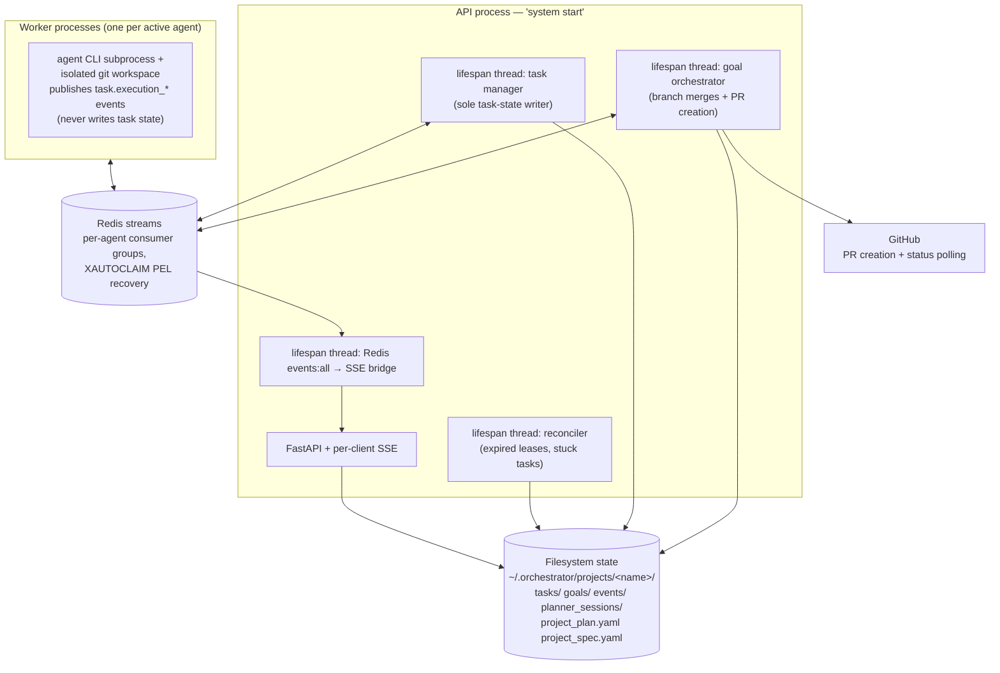

# The pre-refactor backend — features preserved for reintroduction analysis

*The current system (the nine-phase machine on SQLite) replaced a substantially larger one in the 2026-07 refactor. This document records **what the old backend could do that the new one deliberately does not**, why each capability was shelved, and what reintroducing it would take. It exists so those decisions can be revisited with full context instead of re-derived from scratch.*

**Recovering old code:** everything described here is in git history (the pre-refactor tree is reachable before the `refactor/domain` integration commits; the old planner runtime was ported from `git show 8f30306:backend/src/infra/runtime/planners/...`). The old documentation set is archived verbatim in [`../history/pre-refactor/`](../history/pre-refactor/) — [README](../history/pre-refactor/README.md), [architecture](../history/pre-refactor/architecture.md), [authority matrix](../history/pre-refactor/orchestration-authority-matrix.md), [roadmap](../history/pre-refactor/roadmap.md).

## The old system in one diagram

Contrast with today: **two processes, no Redis, no coordinator threads, no reconciler** — the SQLite lease + pull-scan absorbed all of it. The conflict resolution was recorded in the master roadmap's triage: reconciler → *delete* (flow half via pull-scan, crash half via lease); push-dispatch + goal-manager dependency resolution → *delete* (`next_action` owns it); task-manager/goal-manager split → *collapsed into the single pull loop*.

---

## Feature-by-feature record

### 1. GitHub PR gate 🔀 — **DEFER, seam preserved**

**What it did.** The goal orchestrator opened a PR against the base branch when a goal reached `READY_FOR_REVIEW` (idempotent open-or-adopt, `CreateGoalPRUseCase`); the reconciler polled GitHub for checks/approval (`SyncGoalPRStatusUseCase` — poll-only, no progression decisions); `AdvanceGoalFromPRUseCase` turned PR state into `goal.approved`/`goal.merged` transitions and even drove plan-phase completion. **The orchestrator never merged PRs — humans (or a merge queue) did.** Spec-derived CI gates (`min_approvals`, `required_checks`) applied per project.

**Why shelved.** Local outputs (plan-branch merge; zip was also designed) cover the prototype; GitHub coupling added a token, polling loops, and a whole failure domain the core didn't need to prove itself.

**Reintroduction seam.** The `Workspace` port (`backend/src/domain/ports/workplace_port.py`). PR output is an *output strategy* beside the current branch-merge: `commit()` for a plan/goal could push the branch and open a PR instead of (or after) the local merge. The old authority matrix is the design reference for which component owns each PR-driven transition. The old `github_client.py` + `StubGitHubClient` test double are in git history.

**Judgement for later:** high-value once multi-user or CI-gated flows matter; premature while the tool is single-operator local-first.

### 2. Project spec governance 📜 — **DEFER**

**What it did.** `project_spec.yaml` was the canonical, versioned source of architecture constraints (required/forbidden dependencies, directory structure, tech stack, CI gates). Mutation was operator-mediated only: `spec propose → spec diff → spec apply` — agents could *never* write it. Validation hooks checked proposed work against it; the planner received it as context; spec reloads applied to a running API without restart.

**Why shelved.** Governance, not core-flow critical; the nine-phase machine had to prove itself first. Also honestly: the spec endpoints were a source of real bugs (see the [2026-06-08](../history/analyses/2026-06-08-api-endpoint-walkthrough.md) and [2026-06-10](../history/analyses/2026-06-10-spec-api-and-discovery-fixes.md) analyses).

**Reintroduction seam.** The two-tier config store (scope = project id) and the `projects` table already exist. A spec would be a per-project document validated at the edit boundary, rendered into the reasoner's context (`render_plan_context` is the injection point), and enforced as a delete-guard-style check at `apply_edit`/enrichment time. The propose/diff/apply flow maps naturally onto a draft-column + explicit-apply endpoint.

**Judgement for later:** the *idea* (agents constrained by an operator-owned contract) is strong and fits the current design cleanly; bring it back once plans regularly target real repos with conventions worth enforcing.

### 3. Decision gate & decision history 🧭 — **DEFER but KEEP DESIGNED** (the roadmap called it "genuine whitespace")

**What it did.** The old architecture phase produced explicit **architectural decisions** as first-class artifacts alongside phases: each decision was approved, rejected, or edited in `$EDITOR` before the phase plan could proceed; approved decisions were applied to the plan and could derive spec changes. A `plan decision` CLI stub existed for a richer mid-phase decision flow (never completed). Decisions persisted with the planner session — a queryable decision history per project.

**Why shelved.** The new discovery *conversation* absorbed the negotiation function: the user now agrees to the roadmap interactively, so a separate decision-approval artifact was redundant for the prototype (same reasoning that made ARCHITECTURE a passthrough).

**Reintroduction seam.** Two natural homes: (a) a `Decision` artifact attached to the plan document, emitted by the reasoner during discovery/replanning (`submit_goals` could grow a `decisions` field — handlers already re-validate all tool args); (b) a third gate phase. The plan-history mechanism (append-only goals + chat) already gives the *audit trail* half for free.

**Judgement for later:** this is the most distinctive shelved feature — an explicit, reviewable "why" ledger next to the "what". Worth reintroducing as a lightweight artifact (option a) rather than a new phase.

### 4. The old plan lifecycle & planner sessions 🗺 — **REPLACED** (recorded for contrast)

The old progression: `discovery → architecture → phase_active → phase_review → phase_active … → done`, driven by CLI/API **sessions** (`plan init`, `plan architect`, `plan review`) — each a background planner run with its own persisted session record (`planner_sessions/`), decisions/phases proposals, and operator y/n/edit approval. Phases dispatched **goals**; goals expanded into tasks via goal files or JIT planning; `202 + session_id` endpoints + SSE progress covered long operations.

**Why replaced, specifically:**

- The session machinery was the system's chronic failure locus — the archived analyses and plans document the recurring "409: No completed ARCHITECTURE session" dead-end, the terminal-tool name mismatch that burned every architecture run, the timeout-as-protocol discovery router, and the gate desync trilogy (Overview vs GatePanel vs LifecycleRail). Sessions were *state about planning* living outside the plan.
- The new machine makes planning state **be** plan state: conversational phases advance per message (no background session to poll), the roadmap commit is a plan transition, and gates are phases. `MessageResponse{reply, committed, phase}` replaced the whole 202/session/poll pattern.
- What survived: multi-turn discovery (as chat), JIT task population (as ENRICHING), phase review (as the REVIEW gate + REPLANNING loop), and the old planner runtime's *internals* — the tool-calling agent loop, terminal submit tools, `{accepted:false}` self-correction — were ported wholesale into `src/infra/reasoner/runtime/`.

**Do not reintroduce sessions.** If a long autonomous planning pass ever returns (a real ARCHITECTURE), it should be a worker-driven phase like ENRICHING, not a parallel session subsystem.

### 5. Redis event topology ⚡ — **DELETED, port-shaped seam remains**

**What it did.** Redis streams carried all coordination: `task.created/assigned/execution_*`, goal events, per-agent consumer groups (the M1 fix), `XAUTOCLAIM`/PEL recovery for crashed consumers, a Redis→SSE bridge, and the single-writer discipline (workers publish result *events*; only the task manager wrote task state — the old authority matrix codifies this).

**Why deleted.** The SQLite lease + transactional outbox provide the same guarantees with one moving part and real transactions. Redis remains a *roadmap* item (claim-path transport) only if multi-machine workers become real — the repository port is the swap point.

**Worth keeping in mind:** the single-writer lesson survived translation — today it's "the aggregate is the only mutator + version CAS"; the at-least-once + dedup-on-id contract also carried over directly to the outbox relay.

### 6. Operational machinery — **partially absorbed, partially still missing**

| Old capability | Fate |
|---|---|
| Reconciler (expired leases, stuck tasks, requeue) | **Absorbed**: lease expiry + pull-scan; a dead worker's plan is reclaimed from persisted state |
| Worker supervisor (restart with backoff, give-up on crash-loop) | **Dropped** — still missing; ROADMAP #15 (OS-supervised launcher) |
| Per-worker heartbeat/health surface | **Dropped** — still missing; ROADMAP #14 |
| Event journaling to `events/` per project | **Replaced** by outbox + agent_events tables (durable, queryable) |
| `LiveLogger` / planner log replay (`plan logs`) | **Deleted**, recoverable from git history; the ConsoleDock + agent_events cover the live half; replay tooling is ROADMAP #20-adjacent |
| `SettingsService`, `project.json`, filesystem project scoping | **Replaced** by the two-tier SQLite config + `projects` table; per-project *scoping* of plans (old: one active project at a time) has no equivalent yet — plans are global |
| Setup wizard (`orchestrate init`, dependency checks, agent registration) | **Partially replaced** by `seed demo` + `dependency_checker.py` probes; no interactive wizard |
| Env provisioner (uv/Bun) + framework questionnaire | **Never built** in either system; fields-first design noted in the master roadmap (2.8) |

### 7. Old agent/runtime registry — **PORTED**

The runtime types (`dry-run`, `pi`, `claude`, `gemini`), per-agent `runtime_config`, and the capability model all survived, upgraded: registry rows moved from `registry.json` to SQLite, credentials moved from env vars to the encrypted catalog, and resolution became per-run (agent edits/key rotations apply live). The pi backend→env-var mapping (`PI_BACKEND_ENV_VAR`) is a direct port of pi's `env-api-keys.ts` contract.

---

## If you reintroduce something — checklist

1. Find its seam above; if the seam disagrees with current code, fix this doc first.
2. Check [ROADMAP.md](../../ROADMAP.md)'s do-not-do list — some things are rejected, not deferred.
3. A domain-contract change means a recorded un-freeze ([decision log](../decisions/decision-log.md) #40).
4. New coordination features must ride the existing rails: outbox events (never a second event system), the claim predicate (never a new poller), delete-guards (never silent dangling refs).
5. Add the truth-test coverage in the same PR — fake and SQLite backends stay contract-identical.
